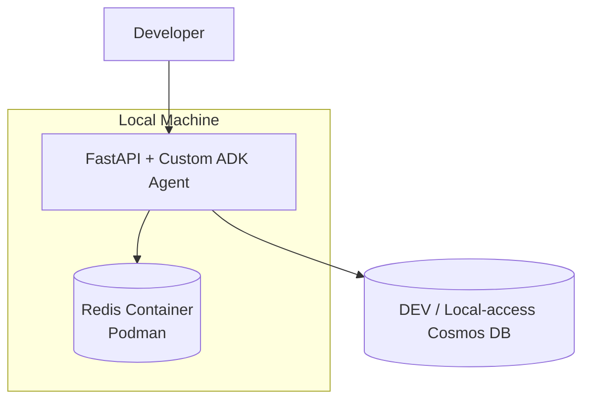
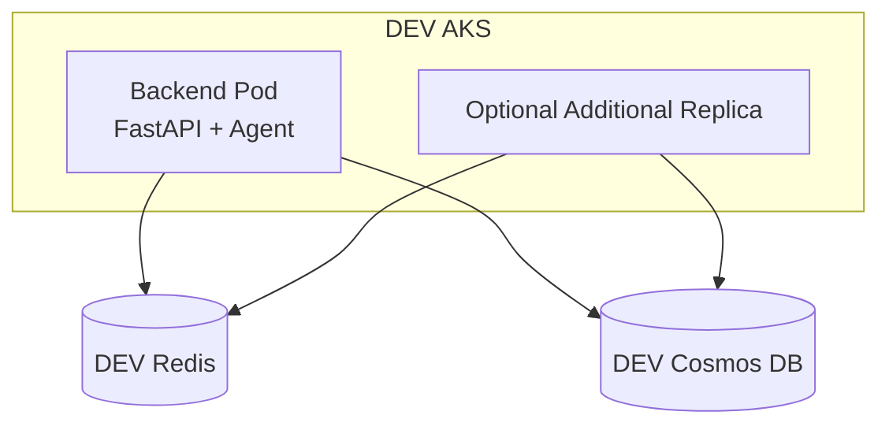
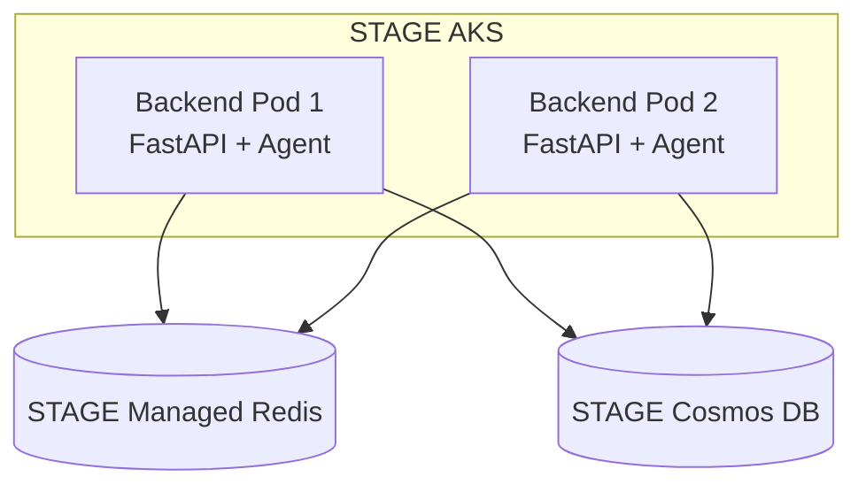
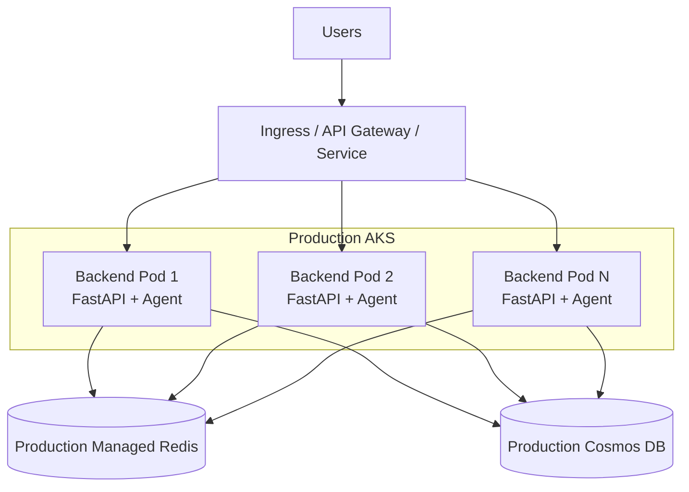
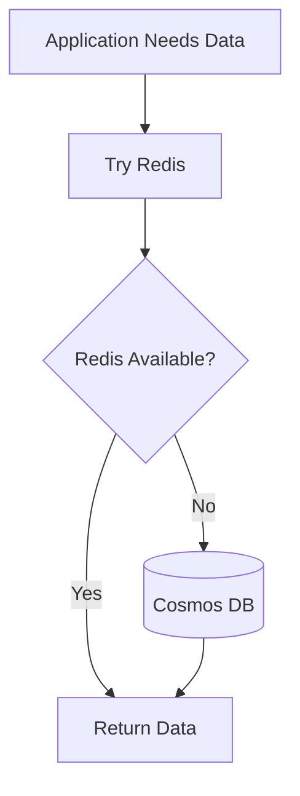
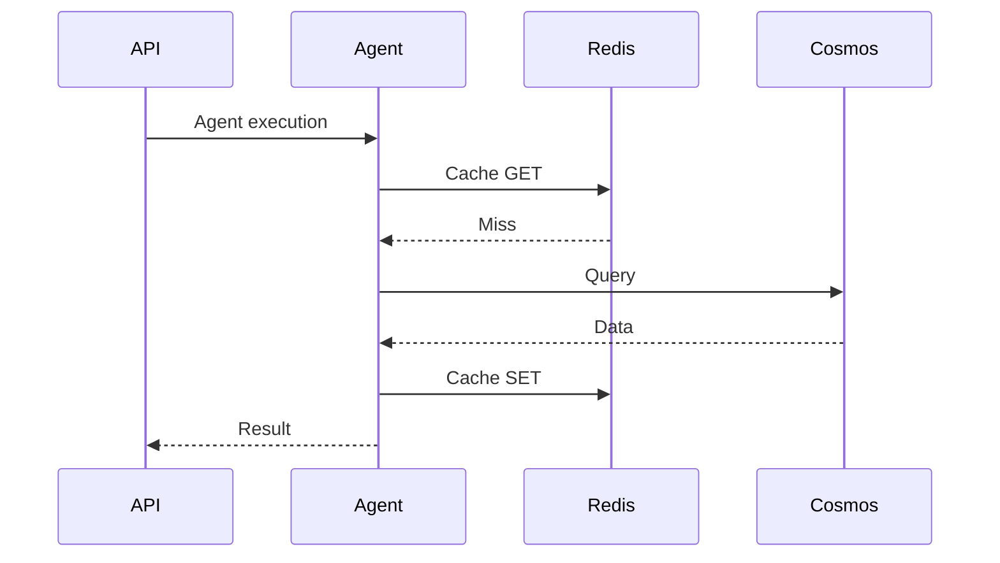

# 5. Infrastructure and Deployment Plan

## 5.1 Purpose of This Section

This section defines:

- what infrastructure must exist,
- what must run locally,
- what must run in DEV,
- what must run in STAGE,
- what must run in PROD,
- what DevOps / platform teams need to provision,
- what configuration the backend requires,
- and how Redis should connect to the AKS-hosted backend.

The objective is to ensure that the application architecture and the infrastructure architecture remain aligned.

---

# 5.2 Infrastructure Components

The complete system will contain the following major components:

```text
Frontend / Consumer

        ↓

AKS Ingress / Service

        ↓

Backend Deployment

FastAPI + Custom ADK Agent

        ↓

   ┌───────────────┐
   │               │
   ▼               ▼

Redis            Cosmos DB

Cache            Source of Truth
```

The existing framework Memory Server may continue to exist independently, but it is not part of this caching architecture.

---

# 5.3 Services That Need to Exist

The target platform requires the following services.

### Backend Service

Contains:

```text
FastAPI
+
Custom ADK Agent
+
Application Logic
+
Redis Client
+
Cosmos Client
```

This remains one deployable backend application.

---

### Cosmos DB

Role:

```text
Authoritative Data Source
```

Cosmos remains responsible for storing the actual business/domain data.

---

### Redis

Role:

```text
Shared Application Cache
```

Redis stores temporary reusable copies of data.

---

### Existing Memory Server

Role:

```text
Existing Custom Framework Capability
```

It is not required for Redis caching.

It should not be included in the cache dependency path.

---

# 5.4 Local Infrastructure

Local development will use:

```text
Podman
```

not Docker.

The recommended setup is:



---

# 5.5 Local Redis Requirements

Developers should be able to start Redis using:

```bash
podman run \
  --name agent-redis \
  -p 6379:6379 \
  -d redis:7
```

If Redis already exists:

```bash
podman start agent-redis
```

To stop:

```bash
podman stop agent-redis
```

To remove:

```bash
podman rm agent-redis
```

---

# 5.6 Local Development Modes

There are two possible local modes.

---

## 5.6.1 Application Runs Directly on Developer Machine

Architecture:

```text
FastAPI + Agent
running directly on host

        ↓

localhost:6379

        ↓

Redis Podman Container
```

Configuration:

```env
REDIS_HOST=localhost

REDIS_PORT=6379

REDIS_SSL=false
```

---

## 5.6.2 Application Also Runs in Podman

Architecture:

```text
Podman Network

├── Backend Container
│
└── Redis Container
```

Then:

```env
REDIS_HOST=redis
```

rather than:

```env
REDIS_HOST=localhost
```

---

# 5.7 Local Podman Network

Example:

```bash
podman network create agent-network
```

Run Redis:

```bash
podman run \
  --name redis \
  --network agent-network \
  -d redis:7
```

Run backend:

```bash
podman run \
  --name backend \
  --network agent-network \
  -e REDIS_HOST=redis \
  -e REDIS_PORT=6379 \
  <backend-image>
```

The two containers can communicate through the Podman network.

---

# 5.8 DEV Infrastructure

DEV runs in AKS.

Recommended architecture:



---

# 5.9 DEV Redis Hosting Decision

DEV has two acceptable options.

### Preferred

```text
Azure Managed Redis
```

because it closely resembles STAGE and PROD.

---

### Alternative

```text
Redis Deployment inside DEV AKS
```

This is acceptable only if:

- DEV is disposable,
- cost is a concern,
- high availability is unnecessary,
- infrastructure drift is acceptable.

---

# 5.10 Recommended DEV Decision

The preferred hierarchy is:

```text
Managed Redis available?
        │
        ├── Yes → Use it
        │
        └── No  → Use Redis in DEV AKS temporarily
```

If Redis is deployed inside DEV AKS, this should be clearly documented as:

```text
Development-only infrastructure
```

and not copied into PROD.

---

# 5.11 STAGE Infrastructure

STAGE should closely resemble PROD.

Recommended:



STAGE should use:

- managed Redis,
- private networking where applicable,
- TLS,
- production-like authentication,
- multiple backend replicas.

---

# 5.12 Production Infrastructure

PROD architecture:



---

# 5.13 Production Redis Must Be External to Backend Pods

Do not design:

```text
Backend Pod

├── FastAPI
├── Agent
└── Redis
```

Redis should not run in the same container as the backend.

The correct model is:

```text
Backend Pod
    ↓
External Redis Service
```

---

# 5.14 Production Redis Hosting Recommendation

Production should use:

```text
Azure Managed Redis
```

rather than a manually managed Redis pod.

This reduces application-team responsibility for:

- failover,
- Redis patching,
- upgrades,
- node recovery,
- persistence configuration,
- replication,
- service availability,
- operational maintenance.

---

# 5.15 Network Connectivity

The intended network path is:

```text
AKS Backend Pod

        ↓

Private Network Path

        ↓

Redis
```

and:

```text
AKS Backend Pod

        ↓

Private / Approved Network Path

        ↓

Cosmos
```

Where organization architecture supports it, Redis should not require unrestricted public access.

---

# 5.16 DNS Requirement

The backend will connect to Redis using a hostname.

Example:

```env
REDIS_HOST=<redis-hostname>
```

Therefore DEV/STAGE/PROD must ensure:

```text
AKS Pod
    ↓
DNS resolution
    ↓
Redis hostname resolves correctly
```

Private endpoint configurations must also include correct DNS integration.

---

# 5.17 TLS

Shared environments should use encrypted Redis communication.

Recommended:

```env
REDIS_SSL=true
```

Local development may use:

```env
REDIS_SSL=false
```

if Redis is only available on the developer machine.

---

# 5.18 Environment Variables Required by Backend

Recommended Redis-related settings:

```env
CACHE_ENABLED=true

CACHE_KEY_PREFIX=benefits-agent

DATASET_VERSION=2026_09

CACHE_TTL_SECONDS=604800

REDIS_HOST=<hostname>

REDIS_PORT=<port>

REDIS_SSL=true

REDIS_DB=0

REDIS_CONNECT_TIMEOUT_SECONDS=2

REDIS_SOCKET_TIMEOUT_SECONDS=2

REDIS_MAX_CONNECTIONS=50
```

Authentication settings depend on infrastructure.

Possible:

```env
REDIS_USERNAME=

REDIS_PASSWORD=
```

if password-based authentication is required.

---

# 5.19 Environment-Specific Configuration

Example:

### Local

```env
ENVIRONMENT=local

REDIS_HOST=localhost

REDIS_PORT=6379

REDIS_SSL=false
```

### DEV

```env
ENVIRONMENT=dev

REDIS_HOST=<dev-redis>

REDIS_SSL=true
```

### STAGE

```env
ENVIRONMENT=stage

REDIS_HOST=<stage-redis>

REDIS_SSL=true
```

### PROD

```env
ENVIRONMENT=prod

REDIS_HOST=<prod-redis>

REDIS_SSL=true
```

---

# 5.20 Kubernetes Deployment Configuration

The backend deployment should receive configuration from approved Kubernetes mechanisms.

Conceptually:

```yaml
env:
  - name: CACHE_ENABLED
    value: "true"

  - name: REDIS_HOST
    valueFrom:
      configMapKeyRef:
        name: backend-config
        key: redis-host

  - name: CACHE_TTL_SECONDS
    value: "604800"
```

Secrets should not be directly embedded as plaintext.

---

# 5.21 ConfigMap vs Secret

Non-sensitive values may be stored using:

```text
ConfigMap
```

Examples:

```text
CACHE_ENABLED

REDIS_PORT

CACHE_TTL_SECONDS

DATASET_VERSION

CACHE_KEY_PREFIX
```

Sensitive values must use approved secret management.

Examples:

```text
Redis Password

Authentication Token
```

---

# 5.22 Infrastructure Ownership

Responsibility should be clear.

Suggested ownership:

### Application Team

Owns:

- Redis client code,
- cache-aside implementation,
- key design,
- TTL design,
- fallback logic,
- cache metrics,
- cache tests.

---

### DevOps / Platform Team

Owns:

- Redis infrastructure provisioning,
- network access,
- private endpoint,
- DNS,
- secrets integration,
- AKS deployment configuration,
- monitoring infrastructure,
- Redis capacity configuration.

---

### Data / Application Owners

Own:

- Cosmos dataset refresh,
- dataset version update,
- validating data freshness.

---

# 5.23 Environment Summary

| Infrastructure | Local | DEV | STAGE | PROD |
|---|---|---|---|---|
| Backend | Local/Podman | AKS | AKS | AKS |
| Container tool | Podman | Docker pipeline | Docker pipeline | Docker pipeline |
| Redis | Podman container | Managed preferred | Managed | Managed |
| Cosmos | DEV-access | DEV | STAGE | PROD |
| TLS | No/Optional | Yes | Yes | Yes |
| Private networking | No | Preferred | Yes | Yes |
| HA | No | Optional | Recommended | Required |
| Shared Redis | Optional | Yes | Yes | Yes |
| Secrets management | Local env | Approved mechanism | Approved mechanism | Approved mechanism |

---

# 6. Security, Reliability, and Failure Scenarios

## 6.1 Purpose of This Section

This section defines how the application should behave when:

- Redis fails,
- Cosmos fails,
- networking fails,
- stale cache exists,
- authentication fails,
- pods restart,
- AKS scales,
- cache entries disappear,
- multiple tenants use the system.

The goal is to prevent Redis from accidentally becoming a new single point of failure.

---

# 6.2 Reliability Principle

The core rule is:

```text
Redis is optional for performance.

Cosmos is required for data correctness.
```

Therefore:

```text
Redis failure
    ↓
Application should continue
```

but:

```text
Cosmos failure
    ↓
Application may no longer be able to obtain authoritative data
```

---

# 6.3 Redis Failure Scenario

Example:

```text
Redis unavailable
```

Possible causes:

- Redis maintenance,
- network issue,
- authentication issue,
- DNS issue,
- service outage.

Expected behaviour:



In simple terms:

```text
Redis fails

    ↓

Log warning

    ↓

Use Cosmos

    ↓

Continue request
```

---

# 6.4 Redis GET Timeout

If Redis GET times out:

```text
Do not wait indefinitely.
```

Expected:

```text
Redis timeout

    ↓

Increment cache error metric

    ↓

Log event

    ↓

Call Cosmos
```

---

# 6.5 Redis SET Failure

Suppose Cosmos query succeeds:

```text
Cosmos
    ↓
returns correct data
```

but Redis SET fails.

Expected:

```text
Return Cosmos result to user.
```

Do not fail the request merely because:

```text
Cache population failed.
```

---

# 6.6 Cosmos Failure Scenario

Suppose Redis has no cached value and Cosmos is unavailable.

```text
Redis miss

    ↓

Cosmos unavailable
```

Now the application cannot retrieve authoritative data.

This is a real application-data failure.

Expected behaviour depends on existing API error handling.

For example:

```text
Service unavailable

or

Domain-specific error
```

This should be treated much more seriously than Redis failure.

---

# 6.7 Cached Data During Cosmos Failure

Suppose:

```text
Redis contains valid cached value
```

and:

```text
Cosmos is temporarily unavailable.
```

The application may still successfully serve the Redis value if the cache entry is valid.

This is a reliability benefit.

However:

> Redis must not be intentionally used as a permanent backup database.

---

# 6.8 Both Redis and Cosmos Fail

Scenario:

```text
Redis unavailable

and

Cosmos unavailable
```

Expected:

```text
Application cannot obtain required domain data.
```

The application should:

- fail predictably,
- return an appropriate error,
- log the dependency failure,
- trigger monitoring/alerting.

---

# 6.9 Failure Priority

A useful severity distinction is:

```text
Redis Down
    =
Degraded Performance


Cosmos Down
    =
Potential Functional Outage
```

This distinction should exist in:

- logs,
- alerts,
- dashboards,
- health endpoints.

---

# 6.10 Backend Pod Restart

A backend pod restart should not affect Redis cache contents.

Architecture:

```text
Redis
    =
External Shared Service
```

Therefore:

```text
Pod 1 restarts
```

Redis still contains the same cached data.

After restart:

```text
Pod 1 reconnects to Redis
```

and continues operating.

---

# 6.11 AKS Scale-Up

Suppose the backend scales from:

```text
2 pods
```

to:

```text
6 pods
```

New pods should immediately connect to the same Redis.

They do not need independent cache warm-up.

Example:

```text
Pod 1 previously cached Employer A.

Pod 6 starts.

Pod 6 requests Employer A.

Pod 6 gets Redis cache hit.
```

This is one of the main advantages of shared Redis.

---

# 6.12 AKS Scale-Down

Suppose Pod 3 is removed.

No important cache data should be lost because Redis is external.

Therefore:

```text
Pod removed
    ≠
Cache removed
```

---

# 6.13 Redis Restart

Redis should be treated as disposable.

If Redis restarts and cached data disappears:

```text
Next request
    ↓
Cache miss
    ↓
Cosmos query
    ↓
Cache rebuild
```

The application should recover automatically.

---

# 6.14 Stale Cache Scenario

The main stale-data risk occurs when:

```text
Cosmos changes
```

but:

```text
Redis still contains older data.
```

The primary protection mechanisms are:

```text
Dataset Versioning

+

TTL
```

---

# 6.15 Dataset Refresh Reliability

When the six-month dataset changes:

```text
Old version:

2026_09

New version:

2027_03
```

the application should switch:

```env
DATASET_VERSION=2027_03
```

This immediately isolates new reads from old cached entries.

---

# 6.16 Avoid Updating Cosmos Without Updating Dataset Version

A risky process is:

```text
Change Cosmos data

but

leave DATASET_VERSION unchanged
```

Then Redis may continue returning old values.

Therefore dataset refresh procedure must include:

```text
Cosmos Data Update

        +

Dataset Version Update
```

These two should be treated as one release activity.

---

# 6.17 Emergency Data Correction

If only one record or employer must be corrected immediately:

```text
Correct Cosmos
```

then explicitly invalidate the related Redis key.

Example:

```text
benefits-agent:prod:2026_09:employer-plans:apple
```

The next request repopulates it.

---

# 6.18 Security Principle

Redis may contain copies of application data.

Therefore it must be protected similarly to other backend infrastructure.

Key protections include:

- network restriction,
- encryption in transit,
- authentication,
- secret protection,
- tenant isolation,
- logging discipline.

---

# 6.19 Network Security

Preferred shared-environment model:

```text
AKS

    ↓

Private Network

    ↓

Redis
```

Avoid exposing Redis broadly to the internet.

---

# 6.20 TLS

DEV/STAGE/PROD should use encrypted Redis connections where supported.

Conceptually:

```text
Backend Pod

    ↓

TLS

    ↓

Redis
```

This protects cached data while in transit.

---

# 6.21 Authentication

Redis access should require an approved authentication mechanism.

Credentials must not be hard-coded into:

```text
Python source code

Git repository

Dockerfile

plain deployment manifests
```

Use approved platform mechanisms.

---

# 6.22 Secret Rotation

The application should not require a code release merely because Redis credentials rotate.

Credentials should be injected externally.

Example:

```text
Key Vault / Secret Store

        ↓

AKS

        ↓

Backend Pod
```

---

# 6.23 Tenant Isolation

If multiple employers use the same backend and Redis, keys must prevent tenant crossover.

Bad:

```text
plans:gold-ppo
```

Better:

```text
benefits-agent:prod:2026_09:plan:apple:gold-ppo
```

This ensures the employer identifier is part of cache identity.

---

# 6.24 Authorization Must Happen Independently of Cache

A critical rule:

> A cache hit must never bypass authorization logic.

Example:

```text
User requests Employer B

Redis has Employer B data
```

The application must still validate that the request is allowed before returning the data.

Redis should never become:

```text
"Data exists, therefore user can access it."
```

---

# 6.25 Cache Key Security

Avoid placing secrets directly into cache keys.

Bad:

```text
session:<access-token>
```

Cache keys may appear in:

- logs,
- Redis inspection,
- monitoring.

Only safe identifiers should be included.

---

# 6.26 Cache Payload Security

Do not cache values merely because they are convenient.

Ask:

```text
Does this payload contain sensitive user-specific data?
```

If yes, evaluate separately before caching.

The initial design should primarily cache:

```text
Shared Cosmos-derived domain data
```

rather than user-specific data.

---

# 6.27 Logging Security

Do not log:

```text
Full Redis payload

Authentication token

Redis password

Full user context

Sensitive personal information
```

Prefer:

```text
cache_key

cache_event

duration

trace_id

error_type
```

---

# 6.28 Cache Poisoning Considerations

Only trusted backend code should be allowed to populate cache values.

Do not let arbitrary frontend input directly become a Redis value without validation.

The normal path should be:

```text
User Input

    ↓

Application Validation

    ↓

Cosmos Query

    ↓

Validated Domain Data

    ↓

Redis
```

---

# 6.29 Graceful Degradation

Redis should have a circuit-like behaviour conceptually.

Repeated failures should not result in every request spending excessive time waiting.

Desired behaviour:

```text
Redis unhealthy
    ↓
Fast failure
    ↓
Cosmos fallback
```

Advanced circuit-breaker implementation can be added later if needed.

---

# 6.30 Timeout Requirements

Cache timeouts should remain short.

The application must prefer:

```text
Fast fallback
```

instead of:

```text
Long Redis wait
```

Recommended starting point:

```env
REDIS_CONNECT_TIMEOUT_SECONDS=2

REDIS_SOCKET_TIMEOUT_SECONDS=2
```

These values should be validated during performance testing.

---

# 6.31 Retry Requirements

Avoid aggressive retry loops.

Bad:

```text
Redis fails

Retry 5 times

Wait repeatedly

Then call Cosmos
```

Better:

```text
Redis fails quickly

Call Cosmos
```

Because Redis is not required for correctness.

---

# 6.32 Health Status

The backend should ideally distinguish:

```text
healthy

degraded

unhealthy
```

Example:

```text
Application healthy
Cosmos healthy
Redis unavailable
```

Result:

```text
degraded
```

rather than:

```text
unhealthy
```

provided the application can still serve required traffic.

---

# 6.33 Example Health Response

Conceptual example:

```json
{
  "status": "degraded",
  "dependencies": {
    "redis": "unavailable",
    "cosmos": "healthy"
  }
}
```

If Cosmos is unavailable:

```json
{
  "status": "unhealthy",
  "dependencies": {
    "redis": "healthy",
    "cosmos": "unavailable"
  }
}
```

---

# 6.34 Reliability Scenario Table

| Scenario | Expected Behaviour |
|---|---|
| Redis hit | Use Redis |
| Redis miss | Query Cosmos, populate Redis |
| Redis timeout | Log + Cosmos fallback |
| Redis unavailable | Cosmos fallback |
| Redis SET fails | Return Cosmos result |
| Redis restart | Cache rebuilds automatically |
| Backend pod restart | Reconnect to existing Redis |
| Backend scales up | New pod shares existing cache |
| Dataset changes | Increment dataset version |
| One record corrected | Delete affected key |
| Cosmos fails + Redis hit | Cached data may still serve |
| Cosmos fails + Redis miss | Request likely fails |
| Redis + Cosmos fail | Functional outage |

---

# 6.35 Reliability Design Summary

The key principle is:

```text
Redis should improve:

Performance

Scalability

Resilience

but should not reduce:

Correctness

Availability

Security
```

---

# 7. Observability and Performance Validation

## 7.1 Purpose of This Section

Adding Redis is not successful merely because:

```text
Redis GET works.
```

The team must be able to prove that Redis:

- reduces Cosmos usage,
- reduces latency,
- behaves correctly,
- fails safely,
- and provides measurable value.

This requires observability.

---

# 7.2 Observability Goals

The application should answer these questions:

```text
How many requests hit Redis?

How many requests miss Redis?

How often is Redis failing?

How much latency does Redis add?

How many requests fall back to Cosmos?

Has Cosmos traffic decreased?

What is the cache hit ratio?

Are any cache keys unusually large?

Is Redis becoming a bottleneck?
```

---

# 7.3 Minimum Metrics

The first implementation should record:

```text
cache_hit_total

cache_miss_total

cache_get_error_total

cache_set_error_total

cache_set_total

cosmos_fallback_total
```

Latency metrics:

```text
cache_get_latency_ms

cache_set_latency_ms

cosmos_query_latency_ms
```

---

# 7.4 Cache Hit Ratio

The primary caching metric is:

```text
Cache Hit Ratio
```

Formula:

```text
Hits
---------------------
Hits + Misses
```

Example:

```text
Hits = 950

Misses = 50
```

Then:

```text
950 / 1000

=

95%
```

---

# 7.5 Why Hit Ratio Matters

A low hit ratio may mean:

- cache keys are too specific,
- TTL is too short,
- access patterns are not reusable,
- cache is being invalidated too often,
- wrong data is being cached.

Given that source data changes roughly once every six months, frequently reused data should generally achieve a strong hit rate after warm-up.

---

# 7.6 Cold Cache vs Warm Cache

Performance must be evaluated separately for:

```text
Cold Cache
```

and:

```text
Warm Cache
```

---

## 7.6.1 Cold Cache

Redis is empty.

Flow:

```text
Request
    ↓
Redis miss
    ↓
Cosmos
    ↓
Redis populate
```

Latency will be similar to or slightly higher than the original Cosmos path because the application also performs cache operations.

---

## 7.6.2 Warm Cache

Redis already contains requested data.

Flow:

```text
Request
    ↓
Redis hit
    ↓
No Cosmos query
```

This is where latency and Cosmos usage should improve.

---

# 7.7 Baseline Measurement

Before enabling Redis in production, measure current behaviour.

Record:

```text
Average response latency

P50 latency

P95 latency

P99 latency

Cosmos query count

Cosmos RU consumption

Requests per second

Error rate
```

This becomes the baseline.

---

# 7.8 Post-Redis Measurement

Measure the same after Redis is enabled.

Then compare:

```text
Before Redis
vs
After Redis
```

---

# 7.9 Expected Improvements

The expected result is:

```text
Repeated Cosmos reads
        ↓

Lower
```

```text
Cosmos RU consumption
        ↓

Lower
```

```text
Frequently accessed data latency
        ↓

Lower
```

```text
Cache hit ratio
        ↑

Higher
```

---

# 7.10 Do Not Assume Performance Improvement

Redis adds an additional dependency.

Therefore performance improvement must be proven.

If the cache hit rate is extremely low:

```text
Redis GET
    ↓
Miss
    ↓
Cosmos
```

can actually add unnecessary latency.

This is why measurements matter.

---

# 7.11 Logging Events

Recommended cache-related events:

```text
CACHE_HIT

CACHE_MISS

CACHE_GET_ERROR

CACHE_SET_ERROR

CACHE_INVALIDATE

CACHE_DISABLED

COSMOS_FALLBACK
```

---

# 7.12 Example Cache Hit Log

```json
{
  "event": "CACHE_HIT",
  "resource": "employer-plans",
  "cache_key": "benefits-agent:prod:2026_09:employer-plans:apple",
  "duration_ms": 2,
  "trace_id": "..."
}
```

---

# 7.13 Example Cache Miss Log

```json
{
  "event": "CACHE_MISS",
  "resource": "employer-plans",
  "cache_key": "benefits-agent:prod:2026_09:employer-plans:apple",
  "trace_id": "..."
}
```

---

# 7.14 Example Redis Failure Log

```json
{
  "event": "CACHE_GET_ERROR",
  "error_type": "TimeoutError",
  "trace_id": "..."
}
```

Avoid logging:

```text
Redis password

full cached payload

user-sensitive context
```

---

# 7.15 Distributed Trace Integration

If existing tracing is already available, Redis operations should be correlated with the existing request trace.

Example:

```text
HTTP Request

    ↓

Agent Execution

    ↓

Cache GET

    ↓

Cosmos Query

    ↓

Cache SET

    ↓

Agent Computation

    ↓

Response
```

---

# 7.16 Trace Example

Conceptually:



Tracing should make this path visible.

---

# 7.17 Dashboard Requirements

A Redis caching dashboard should ideally contain:

```text
Cache Hit Rate

Cache Miss Rate

Cache Errors

Redis Latency

Cosmos Fallback Count

Cosmos Request Rate

Application Response Latency

Redis Memory Usage

Redis Connections
```

---

# 7.18 Example Dashboard Layout

```text
-------------------------------------

Cache Hit Ratio

94%

-------------------------------------

Cache Hits / min

2,400

Cache Misses / min

150

-------------------------------------

Redis Errors

3

-------------------------------------

Cosmos Calls

Before Redis: 2,500/min

After Redis: 180/min

-------------------------------------

P95 Response Latency

Before: 850 ms

After: 430 ms

-------------------------------------
```

These numbers are examples only.

Actual success metrics must come from testing.

---

# 7.19 Redis Infrastructure Metrics

Infrastructure monitoring should also include:

```text
Memory Usage

CPU

Connections

Evicted Keys

Expired Keys

Network Throughput

Latency

Availability
```

---

# 7.20 Eviction Monitoring

Redis may remove keys when memory limits are reached depending on configuration.

Monitor:

```text
evicted_keys
```

A sudden increase may indicate:

- Redis sizing too small,
- unexpected cache growth,
- excessively large values,
- poor TTL strategy.

---

# 7.21 Key Expiration Monitoring

Monitor:

```text
expired_keys
```

This helps understand how frequently TTL-based cleanup occurs.

---

# 7.22 Connection Monitoring

Each backend pod will have its own connection pool.

As pod count increases:

```text
Total Redis Connections
```

also increases.

Example:

```text
10 backend pods

×
50 max connections

=
up to 500 potential connections
```

The actual pool size must therefore be validated against Redis capacity.

---

# 7.23 Cache Value Size

Very large cached values may create:

- high Redis memory use,
- increased network time,
- expensive serialization,
- expensive deserialization.

If practical, observe approximate serialized size.

Example metric:

```text
cache_value_size_bytes
```

---

# 7.24 Performance Test Scenarios

Testing should include several scenarios.

---

## Scenario 1 — Redis Disabled

```env
CACHE_ENABLED=false
```

Measure original application behaviour.

---

## Scenario 2 — Cold Cache

```text
Redis empty
```

Send representative traffic.

Measure:

- Cosmos usage,
- cache misses,
- latency.

---

## Scenario 3 — Warm Cache

Send same or similar traffic again.

Expected:

```text
Cache hit ratio increases

Cosmos traffic decreases
```

---

## Scenario 4 — Redis Failure

Make Redis unavailable.

Expected:

```text
Application still works

Cosmos fallback increases

Cache error metric increases
```

---

## Scenario 5 — High Concurrency

Send high request volume.

Validate:

- connection pooling,
- Redis latency,
- Cosmos fallback,
- application throughput.

---

## Scenario 6 — Multiple Backend Pods

Use multiple replicas.

Verify:

```text
Pod 1 populates cache

Pod 2 receives cache hit
```

---

## Scenario 7 — Dataset Version Change

Change:

```env
DATASET_VERSION
```

Verify:

```text
old cache is ignored

new cache namespace populates
```

---

# 7.25 Cache Effectiveness Test

Suppose the same employer data is requested 10,000 times.

Without cache:

```text
10,000 requests
    ↓
potentially 10,000 Cosmos reads
```

With cache:

```text
First request
    ↓
Cosmos

Remaining repeated requests
    ↓
Redis
```

The actual reduction depends on access patterns and TTL.

---

# 7.26 Load Testing Questions

Load testing should answer:

```text
Does Redis reduce P95 latency?

Does Redis reduce Cosmos RU usage?

Does Redis become a bottleneck?

Does the backend connection pool behave correctly?

Do Redis errors affect user response times?

Does fallback remain stable under Redis outage?
```

---

# 7.27 Success Criteria

Redis should not be considered successful simply because:

```text
No errors are seen.
```

The solution should demonstrate measurable value.

Example success criteria:

```text
High cache hit rate for reusable data

Reduced repeated Cosmos queries

Reduced Cosmos RU consumption

No functional regression

No cross-tenant cache issue

Redis failure does not cause application outage

No unacceptable latency increase on cache miss

Stable operation with multiple AKS replicas
```

---

# 7.28 Alerting

Recommended alerts may include:

```text
High Redis Error Rate

High Redis Latency

Redis Unavailable

Very Low Cache Hit Ratio

High Eviction Rate

Redis Memory Near Limit

Unexpected Cosmos Fallback Increase

Unexpected Cosmos RU Increase
```

---

# 7.29 Example Alert Logic

Example:

```text
Redis cache error rate
>
5%
for
5 minutes
```

could trigger investigation.

Actual thresholds should be based on production baseline.

---

# 7.30 Low Cache Hit Ratio Alert

A low hit ratio does not always mean failure.

For example, a new deployment may have a cold cache.

Therefore alerts should avoid triggering immediately after:

```text
Redis restart

dataset version change

deployment
```

Consider warm-up behaviour when setting thresholds.

---

# 7.31 Cosmos Fallback Alert

Normally:

```text
Cosmos fallback
```

should correspond mostly to cache misses.

If suddenly:

```text
Cosmos fallback increases massively
```

while:

```text
Redis error rate also increases
```

this likely indicates a Redis problem.

---

# 7.32 Observability Correlation

A useful dashboard correlation is:

```text
Redis Errors
        ↑

Cache Hit Ratio
        ↓

Cosmos Requests
        ↑
```

Together these strongly suggest Redis degradation.

---

# 7.33 Performance Baseline Table

The team should record measurements.

Example template:

| Metric | Before Redis | Cold Cache | Warm Cache |
|---|---:|---:|---:|
| P50 Latency | TBD | TBD | TBD |
| P95 Latency | TBD | TBD | TBD |
| P99 Latency | TBD | TBD | TBD |
| Cosmos Calls/min | TBD | TBD | TBD |
| Cosmos RU/min | TBD | TBD | TBD |
| Cache Hit Ratio | N/A | TBD | TBD |
| Error Rate | TBD | TBD | TBD |
| Requests/sec | TBD | TBD | TBD |

Do not populate this table with assumed numbers.

Use actual DEV/STAGE test results.

---

# 7.34 Observability Ownership

### Application Team

Owns:

- cache hit/miss metrics,
- cache error metrics,
- trace instrumentation,
- cache fallback logs.

---

### Platform / DevOps

Owns:

- Redis infrastructure metrics,
- Redis availability monitoring,
- Redis memory alerts,
- network alerts.

---

### Joint Ownership

Both teams should validate:

```text
application behaviour
+
infrastructure behaviour
```

during Redis incidents.

---

# 7.35 Final Observability Principle

The Redis implementation is only complete when the team can confidently answer:

```text
Is Redis working?

Is Redis useful?

Is Redis fast?

Is Redis reducing Cosmos usage?

Is Redis failing safely?

Is Redis causing any new bottleneck?
```

If these questions cannot be answered from logs, metrics, and traces, observability is incomplete.
