Below is the Markdown code for **Sections 1 and 2**. You can paste/type this directly into `plan.md`.

````markdown
# Redis Caching Plan for FastAPI + Custom ADK Agent on AKS

> **Document Purpose**
>
> This document describes the architecture and implementation plan for introducing Redis caching into the existing FastAPI + Custom ADK Agent application.
>
> The document is intended to be understandable by:
>
> - developers implementing the solution,
> - GitHub Copilot while making code changes,
> - architects reviewing the design,
> - DevOps engineers deploying the required services,
> - and developers who may have no prior knowledge of the current application.
>
> The document deliberately explains both **what needs to be done** and **why it needs to be done**.

---

# 1. Current Architecture and Problem Statement

## 1.1 Current Application Architecture

The backend application currently consists of:

- FastAPI
- Custom ADK-based Agent
- Application/business logic
- Cosmos DB integration

An important architectural point is:

> **FastAPI and the Custom ADK Agent are part of the same application and run inside the same backend pod.**

They are **not** two separate microservices.

They are also **not** deployed as two separate AKS pods.

The simplified application structure is:

```text
Backend Application
│
├── FastAPI
│
├── Custom ADK Agent
│
├── Agent Tools
│
├── Business / Computation Logic
│
└── Cosmos DB Integration
```

When deployed to AKS, this entire application is packaged into one container image and runs inside the backend pod.

---

## 1.2 Current Runtime Architecture

The current architecture can be represented as:

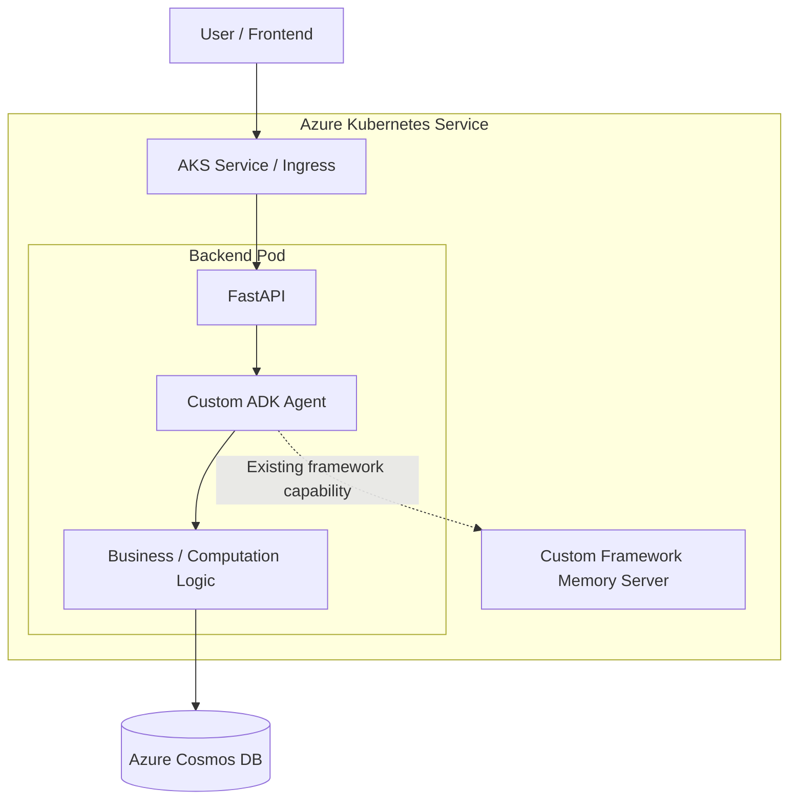

The Custom Framework Memory Server exists in the environment, but the proposed caching design does **not** depend on it.

---

## 1.3 FastAPI and Agent Being in the Same Pod Is Not a Design Flaw

The current application should **not** automatically be redesigned into:

```text
FastAPI Service
      ↓
Agent Service
```

There is currently no requirement that justifies separating them.

The correct design is:

```text
One Backend Application
        │
        ├── FastAPI API Layer
        │
        ├── Custom ADK Agent
        │
        ├── Agent Tools
        │
        └── Business Logic
```

Keeping FastAPI and the agent in the same pod is reasonable because:

- FastAPI exists primarily to expose the agent.
- FastAPI and the agent are released together.
- They belong to the same application lifecycle.
- They currently scale together.
- They use the same Python/runtime environment.
- No other application currently needs to call the agent as an independent service.
- The agent is directly invoked from the API layer.

Therefore:

> **FastAPI + Agent should continue to remain one deployable backend service unless a real scaling or isolation requirement appears later.**

---

## 1.4 When FastAPI and Agent Could Be Split in the Future

This plan does not recommend splitting them now.

However, separation may become useful later if one or more of the following happens:

### Different scaling requirements

Example:

```text
FastAPI requires:
2 CPU
2 GB RAM

Agent requires:
8 CPU
32 GB RAM
```

If the agent becomes significantly heavier than the API layer, independent scaling may become useful.

---

### GPU requirements

If the agent requires GPU resources but FastAPI does not, separating them may avoid unnecessarily assigning GPU resources to API pods.

---

### Long-running agent tasks

If agent requests start taking minutes rather than seconds, an asynchronous architecture may become better:

```text
FastAPI
   ↓
Queue
   ↓
Agent Worker
```

---

### Multiple applications need the agent

If several internal applications eventually need to call the same agent, exposing the agent as an internal service may make sense.

---

### Independent releases

If FastAPI and the agent eventually have different deployment schedules, separating them may become beneficial.

None of these requirements are assumed today.

---

# 1.5 Current Data Source

The primary business/domain data required by the agent is stored in:

```text
Azure Cosmos DB
```

The agent uses Cosmos data to perform:

- filtering,
- lookup,
- computation,
- plan comparison,
- business-rule processing,
- calculations,
- and other agent operations.

The important characteristic of this data is:

> **The Cosmos data changes very infrequently — approximately once every six months.**

This is extremely important from a caching perspective.

---

# 1.6 Current Request Flow

Today a request may behave approximately like this:

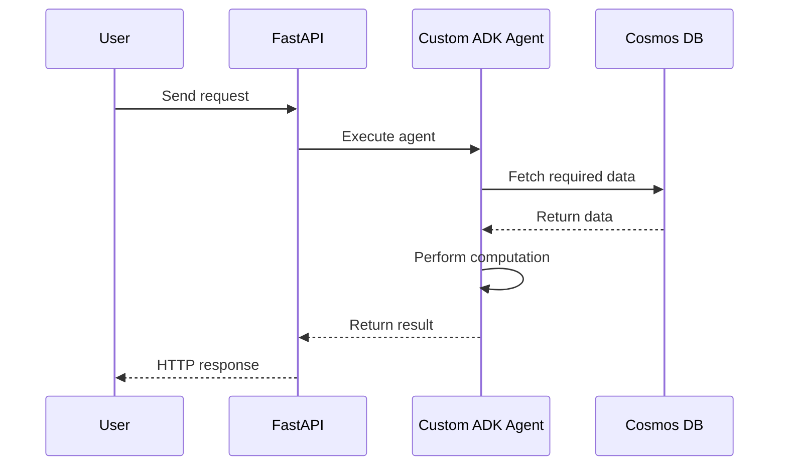

Without caching, repeated requests may repeatedly retrieve the same data.

Example:

```text
Request 1

Agent
  ↓
Cosmos
  ↓
Read Employer A Data


Request 2

Agent
  ↓
Cosmos
  ↓
Read Employer A Data again


Request 3

Agent
  ↓
Cosmos
  ↓
Read Employer A Data again
```

Even though Employer A data may not have changed for several months.

---

# 1.7 Problem With Repeated Cosmos Reads

Repeatedly retrieving stable data creates unnecessary work.

Possible consequences include:

- additional Cosmos RU consumption,
- additional network calls,
- increased response latency,
- unnecessary load on Cosmos,
- repeated serialization/deserialization,
- repeated retrieval of identical information.

For frequently used data, the application should ideally retrieve it once and reuse it.

This is the primary reason Redis is being introduced.

---

# 1.8 Role of Redis

Redis will act as a:

> **Shared application cache**

Redis will contain temporary copies of data that originally comes from Cosmos DB.

The most important distinction is:

```text
Cosmos DB
    =
Source of Truth


Redis
    =
Temporary Fast Copy
```

Redis does **not** replace Cosmos DB.

---

# 1.9 Source of Truth Principle

Cosmos must always remain the authoritative data source.

For example:

```text
Redis contains:

Employer A Plan Data
```

That does **not** mean Redis owns that data.

The actual data still belongs to:

```text
Cosmos DB
```

Redis simply allows the application to access frequently used information faster.

---

# 1.10 Redis Must Be Disposable

The application must assume that Redis can lose its cached data at any time.

Examples:

- Redis restart
- Redis upgrade
- Redis failure
- cache eviction
- manual cache cleanup
- dataset version change
- infrastructure replacement

If Redis becomes empty, the application should still work.

The flow should become:

```text
Redis empty
     ↓
Cache miss
     ↓
Read from Cosmos
     ↓
Return result
     ↓
Rebuild Redis cache automatically
```

Therefore:

> **Redis failure should make the application slower, not unavailable.**

This is one of the most important design principles in this architecture.

---

# 1.11 Why Local Python Memory Is Not Enough

An alternative could be to cache information directly inside Python using:

```python
cache = {}
```

or:

```python
@lru_cache
```

This may work during local development but becomes problematic in AKS.

Suppose AKS has three replicas:

```text
Backend Pod 1

Backend Pod 2

Backend Pod 3
```

Each pod has its own memory.

Therefore:

```text
Pod 1 Cache

Employer A
Employer B


Pod 2 Cache

Employer A


Pod 3 Cache

Employer C
```

The caches become inconsistent.

---

## 1.12 Why Shared Redis Solves This

With Redis:

```text
                Redis

                   │
          ┌────────┼────────┐
          │        │        │
          ▼        ▼        ▼

        Pod 1    Pod 2    Pod 3
```

All pods access the same logical cache.

Example:

```text
Redis:

Employer A
Employer B
Employer C
```

Every backend replica can use these values.

---

## 1.13 Multi-Replica Architecture

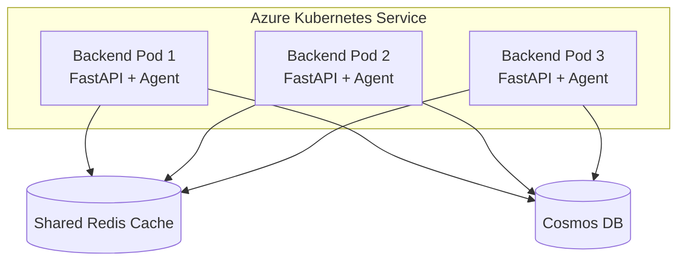

This gives all application replicas a common caching layer.

---

# 1.14 Existing Framework Memory Server

The custom framework currently provides a Memory Server.

This plan does **not** propose using that server for Redis-style data caching.

The two concepts should remain separate.

---

## 1.15 Agent Memory vs Application Cache

Agent memory generally stores things such as:

```text
Conversation History

Previous User Messages

Session State

Agent Checkpoints

User Context

Long-Term Conversational Memory
```

Redis caching in this architecture is primarily intended for:

```text
Cosmos Data

Employer Data

Plan Data

Reference Data

Configuration Data

Reusable Computation Results
```

Therefore:

```text
Agent Memory
      ≠
Redis Application Cache
```

---

## 1.16 Existing Memory Server Decision

The existing framework Memory Server may therefore:

- remain unused,
- be disabled if safely supported by the framework,
- or remain available for future conversation-memory requirements.

However:

> Redis caching should not be architecturally coupled to the framework's memory server.

---

# 1.17 Primary Goals of the Redis Implementation

The caching implementation must achieve the following.

### Functional Goals

1. Reduce unnecessary reads from Cosmos DB.

2. Reuse frequently accessed Cosmos data.

3. Share cached data between all backend replicas.

4. Keep Cosmos DB as the authoritative source.

5. Allow the application to continue working if Redis fails.

6. Support cache invalidation when the approximately six-month data refresh happens.

7. Allow expensive deterministic calculations to be cached later if useful.

---

### Engineering Goals

1. Redis-specific code should not be scattered throughout the agent.

2. The Custom ADK Agent should ideally not know whether data came from Redis or Cosmos.

3. Local development must use **Podman**, not Docker.

4. Dev, Stage and Production will continue using the organization's Docker-based deployment pipeline.

5. Local, Dev, Stage and Production should use the same application code.

6. Environment differences should come from configuration.

7. Redis credentials must never be hard-coded.

8. Redis operations must have proper logging and metrics.

9. Multiple AKS replicas must be able to use the same cache.

10. Cache failures must gracefully fall back to Cosmos.

---

# 2. Target Architecture and Environment Strategy

# 2.1 Target Architecture Overview

The proposed architecture introduces Redis between the application and frequently accessed data.

The backend application remains unchanged from a deployment-boundary perspective.

It remains:

```text
FastAPI + Custom ADK Agent
```

Redis becomes shared infrastructure.

---

## 2.2 Target Production Architecture

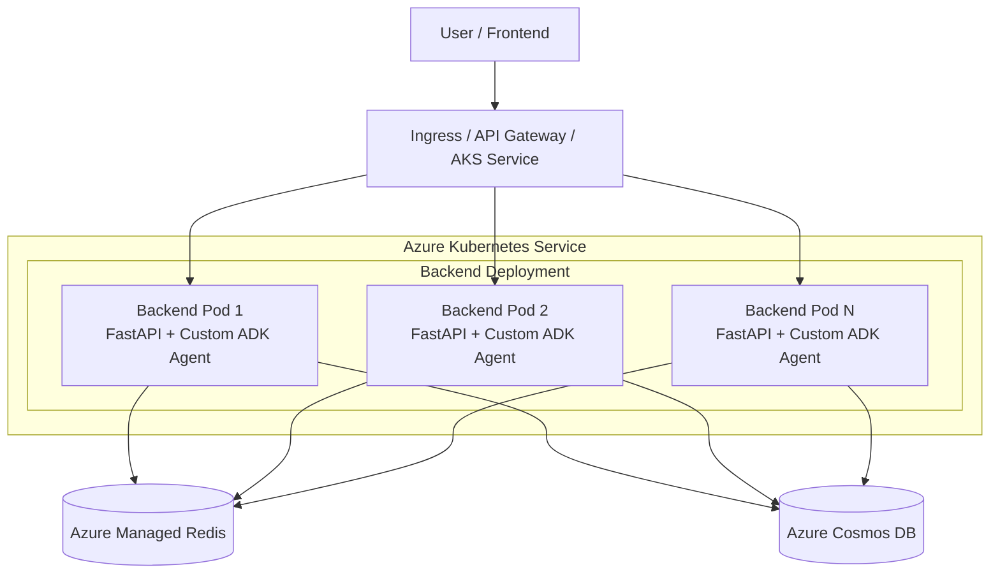

---

# 2.3 Important Architectural Principle

Redis is:

```text
Shared Infrastructure
```

Redis is **not**:

```text
Another Agent

Another FastAPI Service

Another Business Microservice
```

The backend simply connects to Redis in the same way that it connects to other external infrastructure.

---

# 2.4 Recommended Caching Pattern

The recommended caching pattern is:

> **Cache-Aside**

This pattern is simple, predictable and easy to implement.

---

## 2.5 Cache-Aside Flow

The application performs the following steps:

```text
1. Agent needs some data.

2. Data Service generates a Redis key.

3. Application checks Redis.

4. If Redis contains the value:

       Return cached value.

5. If Redis does not contain the value:

       Query Cosmos DB.

6. Store Cosmos result in Redis.

7. Return the result to the agent.
```

---

## 2.6 Cache Hit

Example:

```text
Agent requests Employer A plans

        ↓

Redis GET

        ↓

Employer A already exists

        ↓

Return Redis value

        ↓

No Cosmos query required
```

This is called a:

```text
CACHE HIT
```

---

## 2.7 Cache Miss

Example:

```text
Agent requests Employer B plans

        ↓

Redis GET

        ↓

Employer B does not exist

        ↓

Query Cosmos

        ↓

Get Employer B plans

        ↓

Store result in Redis

        ↓

Return data to agent
```

This is called a:

```text
CACHE MISS
```

---

# 2.8 Cache-Aside Sequence Diagram

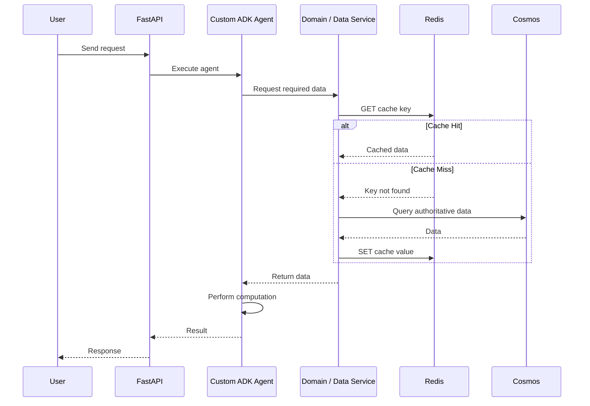

---

# 2.9 Redis Should Not Be Called Directly Everywhere

One of the most important code-design rules is:

> **Do not scatter Redis calls throughout the agent.**

Bad design:

```python
async def run_agent():

    value = await redis.get("some-key")

    # agent logic

    value2 = await redis.get("another-key")

    # more agent logic

    await redis.set("some-other-key", result)
```

This creates tight coupling between:

```text
Agent
and
Redis
```

Later changes become difficult.

---

# 2.10 Recommended Code Responsibility

Instead use:

```text
FastAPI

   ↓

Agent

   ↓

Domain / Data Service

   ↓

Cache Service

   ↓

Redis
```

and:

```text
Domain / Data Service

   ↓

Cosmos Repository

   ↓

Cosmos DB
```

---

## 2.11 Recommended Logical Architecture

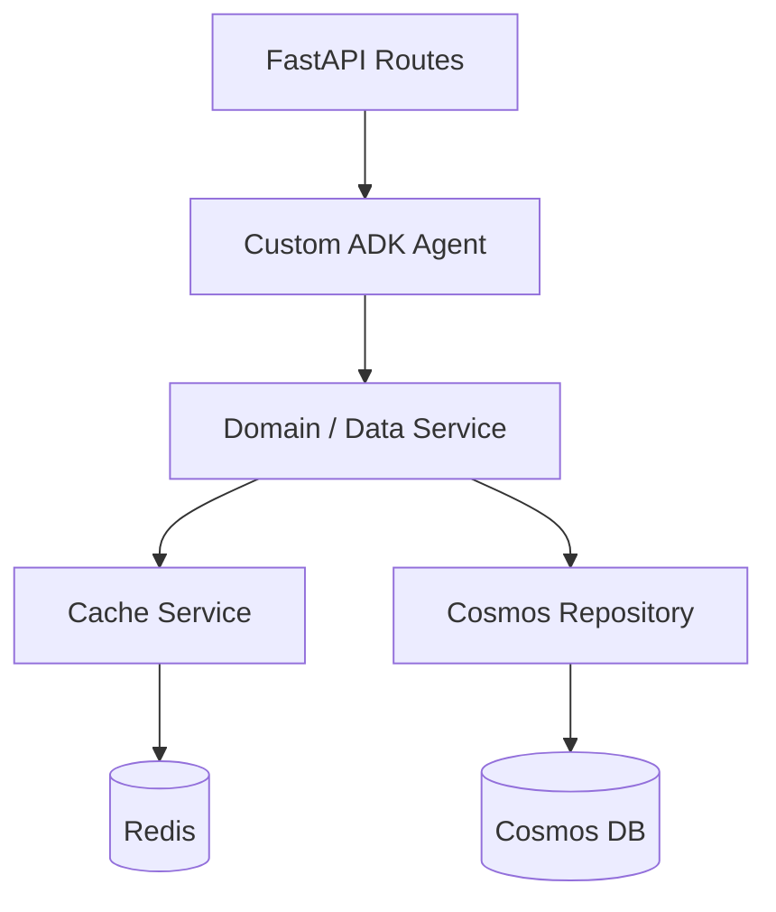

The agent should conceptually perform:

```python
plans = await plan_service.get_plans(
    employer_id=employer_id
)
```

The agent should **not care** whether the data came from:

```text
Redis
or
Cosmos
```

---

# 2.12 Recommended Project Structure

The actual existing repository may differ.

The implementation should adapt to the existing project instead of blindly creating duplicate folders.

However, the logical responsibility should look similar to:

```text
src/
│
├── api/
│   │
│   ├── routes/
│   │   └── chat.py
│   │
│   └── dependencies.py
│
├── agents/
│   │
│   ├── main_agent.py
│   │
│   └── tools/
│
├── services/
│   │
│   ├── plan_service.py
│   ├── employer_service.py
│   └── calculation_service.py
│
├── repositories/
│   │
│   ├── cosmos_repository.py
│   └── interfaces.py
│
├── cache/
│   │
│   ├── redis_client.py
│   ├── cache_service.py
│   ├── cache_keys.py
│   ├── serializers.py
│   └── exceptions.py
│
├── config/
│   │
│   └── settings.py
│
├── observability/
│   │
│   └── cache_metrics.py
│
└── main.py
```

---

# 2.13 Responsibility of `redis_client.py`

This module should be responsible for:

```text
Redis Connection Creation

Connection Pool Management

Authentication

TLS Configuration

Connection Timeout

Read Timeout

Connection Cleanup

Application Shutdown Cleanup
```

The application should not create a new Redis connection for every HTTP request.

---

# 2.14 Responsibility of `cache_service.py`

The cache service should provide a simple application interface such as:

```python
await cache.get(key)

await cache.set(
    key,
    value,
    ttl=ttl
)

await cache.delete(key)

await cache.exists(key)
```

The rest of the application should not need to know details about the Redis client library.

---

# 2.15 Responsibility of `cache_keys.py`

Redis keys must be generated consistently.

Do not write key generation everywhere like:

```python
key = f"employer:{id}:plans"
```

in one file and:

```python
key = f"plans:{id}"
```

somewhere else.

Instead:

```python
def build_employer_plans_key(
    dataset_version: str,
    employer_id: str
) -> str:

    return (
        f"employer-plans:"
        f"{dataset_version}:"
        f"{employer_id}"
    )
```

Example:

```text
employer-plans:2026_09:apple
```

---

# 2.16 Responsibility of `serializers.py`

Redis stores data as bytes/strings.

Application objects therefore need serialization.

For example:

```text
Python Object

     ↓

JSON

     ↓

Redis
```

Then:

```text
Redis

     ↓

JSON

     ↓

Python Object
```

Initially JSON is likely sufficient.

Compression should only be added later if:

- values become very large,
- network transfer becomes significant,
- Redis memory becomes expensive.

Avoid premature optimization.

---

# 2.17 Environment Strategy

The project uses different container tooling depending on the environment.

This must be reflected correctly in the architecture.

The organization currently uses:

```text
LOCAL
    ↓
Podman


DEV / STAGE / PROD
    ↓
Docker-based Build / Deployment Pipeline
```

Therefore:

> Local instructions must use Podman, not Docker.

---

# 2.18 Environment Comparison Table

| Concern | Local | DEV | STAGE | PROD |
|---|---|---|---|---|
| Backend runtime | Local process or Podman container | AKS | AKS | AKS |
| Backend application | FastAPI + Custom ADK Agent | FastAPI + Custom ADK Agent | FastAPI + Custom ADK Agent | FastAPI + Custom ADK Agent |
| Local container tool | **Podman** | N/A | N/A | N/A |
| Image/build workflow | Podman-compatible local workflow | Docker-based pipeline | Docker-based pipeline | Docker-based pipeline |
| Redis hosting | **Redis container using Podman** | Azure Managed Redis preferred | Azure Managed Redis | Azure Managed Redis |
| Cosmos DB | Development Cosmos connection | DEV Cosmos | STAGE Cosmos | PROD Cosmos |
| Redis shared between replicas | Optional locally | Yes | Yes | Yes |
| Redis High Availability | No | Usually minimal | Recommended | Production-grade |
| TLS to Redis | Optional locally | Yes | Yes | Yes |
| Private networking | No | Preferred | Yes | Yes |
| Public Redis access | localhost only | Prefer disabled | Disabled | Disabled |
| Redis secrets | Local developer secret/env | Approved secret mechanism | Approved secret mechanism | Managed Identity or approved secret mechanism |
| Redis failure fallback | Cosmos | Cosmos | Cosmos | Cosmos |
| Cache logging | Basic | Yes | Yes | Full |
| Cache metrics | Optional | Yes | Yes | Yes |
| Dataset versioning | Yes | Yes | Yes | Yes |
| Cache is durable storage | No | No | No | No |
| Framework Memory Server required | No | No | No | No |

---

# 2.19 Local Environment

Local development should use:

```text
Podman
```

The Redis service should therefore run as a Podman container.

---

## 2.20 Local Architecture

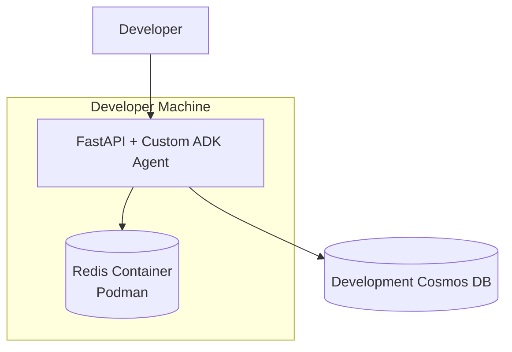

---

# 2.21 Starting Redis Locally

Example:

```bash
podman run \
  --name agent-redis \
  -p 6379:6379 \
  -d redis:7
```

This creates:

```text
Redis Container

Host:
localhost

Port:
6379
```

---

# 2.22 Local FastAPI Running Outside Podman

If FastAPI runs directly on the developer machine:

```text
Developer Machine

FastAPI + Agent

       │

       ▼

localhost:6379

       │

       ▼

Podman Redis
```

Configuration:

```env
REDIS_HOST=localhost

REDIS_PORT=6379

REDIS_SSL=false

CACHE_ENABLED=true
```

---

# 2.23 Local FastAPI Running Inside Podman

If both the application and Redis are running as containers, they should use the same Podman network.

Example:

```text
Podman Network

agent-local

├── backend
│
└── redis
```

The application should then connect to:

```env
REDIS_HOST=redis

REDIS_PORT=6379
```

instead of:

```env
REDIS_HOST=localhost
```

The application code should remain unchanged.

Only environment configuration changes.

---

# 2.24 DEV Environment

There are two possible approaches for DEV.

---

## 2.25 DEV Option A — Redis Inside AKS

A DEV-only Redis container could technically be deployed inside AKS.

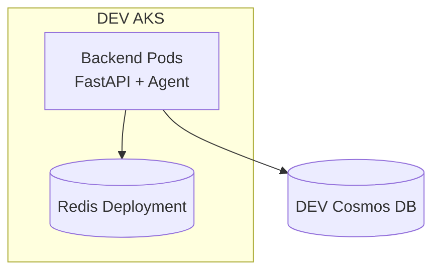

This can be acceptable when DEV is:

- disposable,
- cost-sensitive,
- non-production,
- not expected to provide Redis HA.

---

## 2.26 Disadvantage of Redis Inside DEV AKS

If DEV uses:

```text
Redis Pod inside AKS
```

while Stage/Prod use:

```text
Azure Managed Redis
```

then DEV does not fully test the production architecture.

Possible missing validations include:

```text
TLS

Private Endpoint

DNS

Authentication

Azure Networking

Managed Identity

Managed Redis Timeouts
```

This is known as:

```text
Environment Drift
```

---

# 2.27 DEV Option B — Azure Managed Redis

If cost and organizational policy permit, DEV should use its own managed Redis instance.

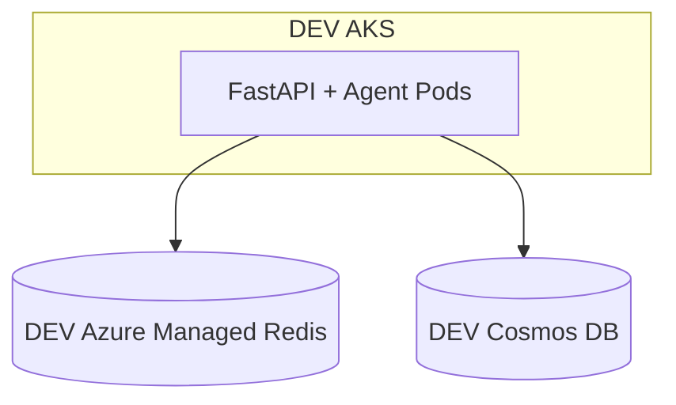

This is the preferred approach because:

```text
DEV
  ↓
resembles
  ↓
STAGE
  ↓
resembles
  ↓
PROD
```

---

# 2.28 Stage Environment

Stage should be very close to production.

Recommended:

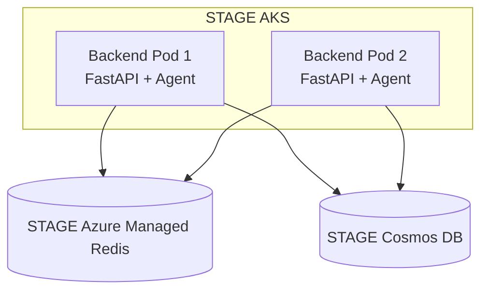

Stage should validate:

- multiple backend replicas,
- shared Redis cache,
- Redis connection pooling,
- TLS,
- private networking,
- authentication,
- cache hit behavior,
- cache miss behavior,
- Cosmos fallback,
- Redis restart behavior,
- dataset version change,
- deployment rollout behavior.

---

# 2.29 Production Environment

Production should use:

```text
Azure Managed Redis
```

Redis should **not** initially be deployed as a single normal Redis container beside the application in AKS.

---

## 2.30 Production Architecture

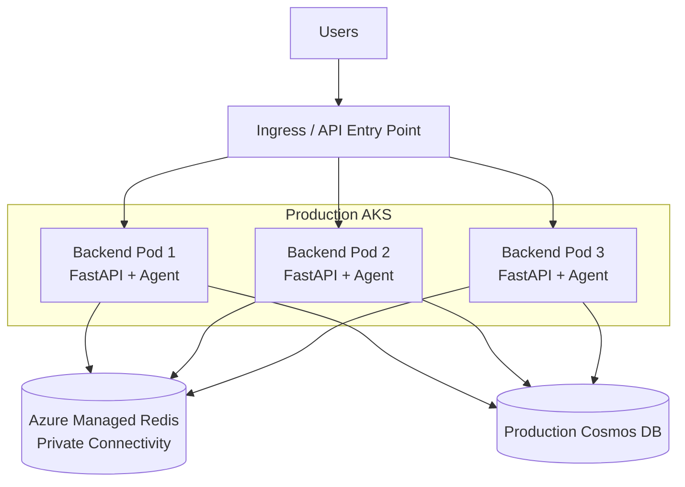

---

# 2.31 Why Redis Should Not Be a Single Production AKS Pod

Running Redis inside AKS is technically possible.

Example:

```text
AKS

├── Backend Deployment
│
└── Redis Deployment
```

However, if we operate Redis ourselves, the team becomes responsible for:

- Redis upgrades,
- Redis patching,
- replica management,
- persistence,
- StatefulSets,
- Persistent Volumes,
- failover,
- node failures,
- pod rescheduling,
- backups if persistence is expected,
- availability configuration,
- monitoring,
- recovery,
- memory sizing,
- eviction policies,
- disruption handling.

That is significant operational work for something whose primary purpose is simply:

```text
Caching
```

Managed Redis removes much of this infrastructure-management responsibility.

---

# 2.32 Environment Recommendation Summary

```text
LOCAL

Redis through Podman
        ✔


DEV

Azure Managed Redis
        ✔ Preferred

Redis in DEV AKS
        ✔ Possible if cost constrained


STAGE

Azure Managed Redis
        ✔ Recommended


PROD

Azure Managed Redis
        ✔ Strongly Recommended
```

---

# 2.33 Final Target Request Flow

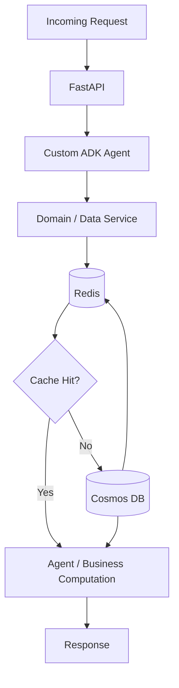

---

# 2.34 Same Flow Explained in Simple Language

The architecture can be understood using the following example.

Suppose the user asks:

```text
Give me information about Employer A's plans.
```

The application does:

```text
Step 1

FastAPI receives the request.


Step 2

FastAPI invokes the Custom ADK Agent.


Step 3

The agent determines that Employer A plan data is needed.


Step 4

The application asks Redis:

"Do you already have Employer A's plan data?"


Step 5A

If Redis says YES:

Use the Redis data.


Step 5B

If Redis says NO:

Query Cosmos DB.


Step 6

If Cosmos was queried:

Store the Cosmos result in Redis.


Step 7

Give the data back to the agent.


Step 8

The agent performs its computation.


Step 9

FastAPI returns the response to the user.
```

The key idea is extremely simple:

```text
Check Redis first.

If found:
    use Redis.

If not found:
    use Cosmos
    and save a copy in Redis.
```

---

# 2.35 Failure Behaviour

Another important requirement is Redis failure handling.

The system should behave like:

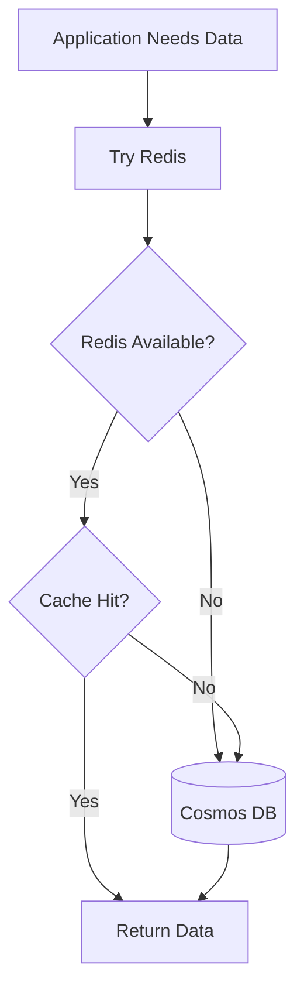

Therefore:

```text
Redis unavailable

        ↓

Log warning

        ↓

Query Cosmos

        ↓

Continue request
```

Redis must not become a mandatory dependency for application correctness.

---

# 2.36 High-Level Final Architecture

The final design should therefore be understood as:

```text
                         Azure Managed Redis
                                ▲
                                │
                    Shared Application Cache
                                │
                                │
      ┌─────────────────────────┼─────────────────────────┐
      │                         │                         │
      │                         │                         │
Backend Pod 1             Backend Pod 2             Backend Pod N

FastAPI                   FastAPI                   FastAPI

   +                         +                         +

Agent                     Agent                     Agent

      │                         │                         │
      └─────────────────────────┼─────────────────────────┘
                                │
                                ▼

                            Cosmos DB

                         Source of Truth
```

---

# 2.37 Core Architecture Decisions

The design decisions established so far are:

### Decision 1

FastAPI and the Custom ADK Agent remain inside the same backend deployable unit.

```text
FastAPI + Agent
```

They are not split into separate services.

---

### Decision 2

Cosmos DB remains the authoritative data source.

```text
Cosmos DB
=
Source of Truth
```

---

### Decision 3

Redis is introduced as a shared cache.

```text
Redis
=
Temporary Shared Cache
```

---

### Decision 4

Redis uses the cache-aside pattern.

```text
Check Redis

    ↓

Miss

    ↓

Cosmos

    ↓

Populate Redis
```

---

### Decision 5

Redis failure must not break the application.

```text
Redis failure
      ↓
Cosmos fallback
```

---

### Decision 6

Local Redis will run using **Podman**.

Docker should not be used for local Redis instructions.

---

### Decision 7

Dev, Stage and Production continue using the existing Docker-based container build/deployment process.

---

### Decision 8

Stage and Production should use Azure Managed Redis.

DEV should preferably also use Managed Redis if budget allows.

---

### Decision 9

The Custom Framework Memory Server is not part of this caching implementation.

---

### Decision 10

Redis access should be hidden behind a cache/data-service abstraction instead of being directly called throughout agent code.

---

# Next Sections

The next two sections of this document will cover:

## Section 3 — Detailed Cache Design

This section will define:

- exactly what should be cached,
- what should not be cached,
- Cosmos data caching,
- computation caching,
- Redis key structure,
- versioned cache keys,
- TTL strategy,
- six-month dataset refresh handling,
- cache invalidation,
- eviction,
- cache stampede / thundering herd,
- negative caching,
- cache size considerations.

---

## Section 4 — Code Implementation Plan

This section will define:

- Python Redis dependency,
- async Redis client,
- connection pooling,
- FastAPI startup/lifespan integration,
- shutdown handling,
- configuration model,
- cache service implementation,
- Redis client implementation,
- cache key builder,
- Cosmos repository integration,
- domain service integration,
- graceful Redis failure,
- logging,
- metrics,
- example Python implementation,
- changes Copilot should make,
- files that should be created or modified.
````
