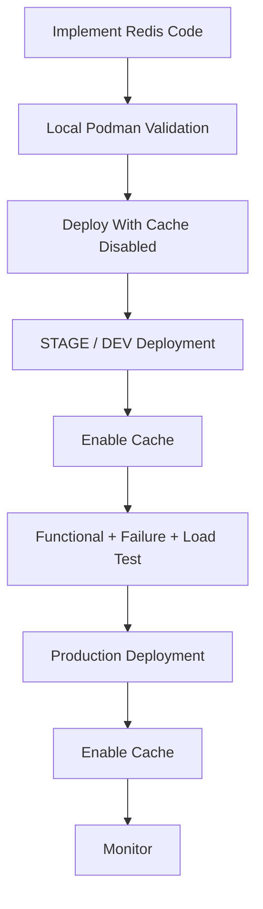
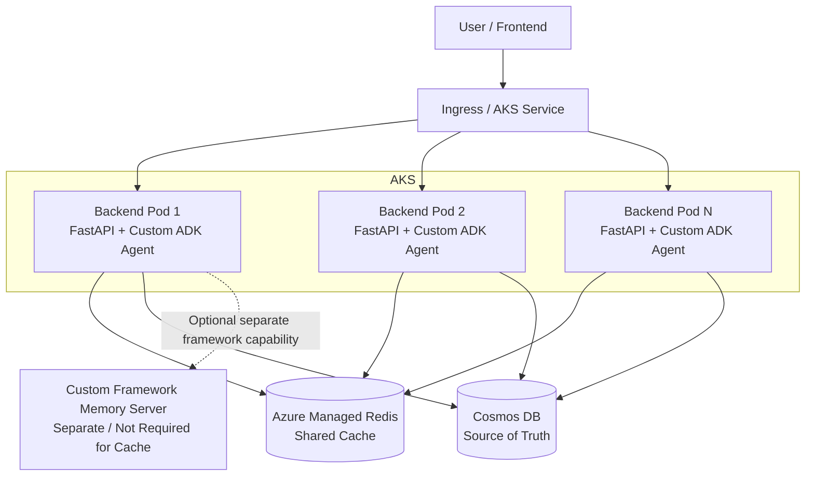

# 8. Rollout, Migration, and Rollback Plan

## 8.1 Purpose of This Section

This section defines how Redis caching should be introduced safely into the application.

The goal is to avoid a deployment where:

```text
Redis code is added
    ↓
Redis is enabled immediately
    ↓
Problem occurs
    ↓
No simple rollback exists
```

Instead, the rollout should be controlled, measurable, and reversible.

---

## 8.2 Environment Model Used in This Plan

For the purpose of rollout, the application has the following environment model:

```text
LOCAL
    ↓
Developer machine
Podman


STAGE / DEV
    ↓
Shared non-production AKS environment
Docker-based deployment pipeline


PROD
    ↓
Production AKS environment
Docker-based deployment pipeline
```

There is no requirement to treat DEV and STAGE as two independent environments.

Throughout Sections 8, 9, and 10:

```text
STAGE / DEV
```

means the shared non-production environment used for:

- integration testing,
- infrastructure validation,
- Redis validation,
- load testing,
- failure testing,
- release verification.

---

## 8.3 Rollout Principle

The recommended rollout sequence is:

```text
Implement Redis capability
        ↓
Keep caching disabled
        ↓
Validate locally
        ↓
Deploy to STAGE / DEV
        ↓
Validate with cache disabled
        ↓
Enable Redis in STAGE / DEV
        ↓
Functional testing
        ↓
Failure testing
        ↓
Performance testing
        ↓
Production deployment
        ↓
Enable Redis
        ↓
Monitor
```

The main control mechanism is:

```env
CACHE_ENABLED=true
```

or:

```env
CACHE_ENABLED=false
```

---

## 8.4 Phase 1 — Code Preparation

Introduce the Redis capability into the backend without immediately changing runtime behavior.

Changes include:

```text
Redis Python dependency

Redis client

Connection pooling

Cache service

Cache key builder

Configuration

Dataset version support

TTL support

Failure fallback

Metrics

Logging

Unit tests

Integration tests
```

Initially configure:

```env
CACHE_ENABLED=false
```

With caching disabled, the application should continue using the existing flow:

```text
FastAPI
    ↓
Custom ADK Agent
    ↓
Domain / Data Logic
    ↓
Cosmos DB
```

---

## 8.5 Phase 2 — Local Redis Validation

Local Redis should run using:

```text
Podman
```

Example:

```bash
podman run \
  --name agent-redis \
  -p 6379:6379 \
  -d redis:7
```

Example local configuration:

```env
ENVIRONMENT=local

CACHE_ENABLED=true

REDIS_HOST=localhost

REDIS_PORT=6379

REDIS_SSL=false

DATASET_VERSION=2026_09

CACHE_TTL_SECONDS=604800
```

---

## 8.6 Local Functional Test

The developer should validate:

```text
First request
    ↓
Redis MISS
    ↓
Cosmos query
    ↓
Redis SET
    ↓
Response
```

Then:

```text
Second equivalent request
    ↓
Redis HIT
    ↓
No Cosmos query required
    ↓
Response
```

---

## 8.7 Local Failure Test

Stop Redis:

```bash
podman stop agent-redis
```

Then send another request.

Expected:

```text
Redis connection fails
    ↓
CACHE_GET_ERROR logged
    ↓
Application falls back to Cosmos
    ↓
Request succeeds
```

This test is mandatory because graceful Redis failure is a primary architectural requirement.

---

## 8.8 Phase 3 — Provision STAGE / DEV Infrastructure

Before enabling caching in the shared non-production environment, the required Redis infrastructure must exist.

Preferred:

```text
Azure Managed Redis
```

Alternative, if infrastructure constraints require it:

```text
Redis deployed inside non-production AKS
```

However, Managed Redis is preferred because it better represents the intended production architecture.

Required infrastructure includes:

```text
Redis instance

Redis hostname

Redis port

TLS configuration

Authentication

Network connectivity

Private endpoint where applicable

DNS resolution

Secret integration

Monitoring
```

---

## 8.9 Phase 4 — Deploy to STAGE / DEV With Cache Disabled

Deploy the Redis-capable backend with:

```env
CACHE_ENABLED=false
```

This verifies that adding Redis support has not changed existing application behavior.

Validate:

```text
Application starts normally

FastAPI works normally

Agent works normally

Cosmos queries work normally

Redis does not become a required startup dependency

Existing API behavior remains unchanged
```

---

## 8.10 Phase 5 — Enable Redis in STAGE / DEV

After confirming the application is stable:

```env
CACHE_ENABLED=true
```

Enable Redis caching.

Validate:

```text
Redis connection

Redis authentication

TLS

DNS

Cache key generation

Cache miss

Cosmos fallback

Cache population

Cache hit

TTL

Dataset version

Metrics

Logging
```

---

## 8.11 STAGE / DEV Cache Validation Checklist

```text
[ ] Redis connection succeeds

[ ] First request produces cache miss

[ ] Cosmos is called on cache miss

[ ] Cosmos result is written to Redis

[ ] Repeated request produces cache hit

[ ] Cosmos is not called on cache hit

[ ] Redis timeout falls back to Cosmos

[ ] Redis GET failure does not fail user request

[ ] Redis SET failure does not fail user request

[ ] CACHE_ENABLED=false bypasses Redis

[ ] Cache keys contain environment

[ ] Cache keys contain dataset version

[ ] Cache keys contain employer/tenant identifier when required

[ ] Cache TTL is applied

[ ] Metrics are emitted

[ ] Logs correctly identify HIT, MISS, and ERROR
```

---

## 8.12 Multi-Pod Validation

The shared environment should run multiple backend replicas during validation.

Example:

```text
Request 1
    ↓
Pod 1
    ↓
Redis MISS
    ↓
Cosmos
    ↓
Redis SET
```

Then:

```text
Request 2
    ↓
Pod 2
    ↓
Redis HIT
```

This proves that Redis is functioning as a shared cache rather than pod-local cache.

---

## 8.13 Failure Validation

Redis should intentionally be made unavailable in the shared environment.

Expected:

```text
Backend Pods
    ↓
Redis unavailable
    ↓
Short timeout
    ↓
Cosmos fallback
    ↓
Application remains functional
```

Metrics should show:

```text
cache_error_total ↑

cosmos_fallback_total ↑
```

The user-facing request should still succeed if Cosmos is healthy.

---

## 8.14 Cold Cache Testing

Clear or recreate the test Redis cache.

Then send representative requests.

Measure:

```text
Cache misses

Cosmos queries

Response latency

Redis SET operations
```

This represents:

```text
Cold Cache
```

---

## 8.15 Warm Cache Testing

Repeat representative requests.

Measure:

```text
Cache hits

Cosmos queries

Response latency

Cache hit ratio
```

This represents:

```text
Warm Cache
```

The difference between cold and warm cache behavior should be documented.

---

## 8.16 Dataset Version Migration Test

Initial configuration:

```env
DATASET_VERSION=2026_09
```

Populate Redis.

Example key:

```text
benefits-agent:stage:2026_09:employer-plans:apple
```

Then change:

```env
DATASET_VERSION=2027_03
```

Expected:

```text
Application stops requesting 2026_09 keys

New requests produce cache misses for 2027_03

Cosmos is queried

2027_03 Redis keys are created

2026_09 keys remain temporarily but are unused

Old keys eventually disappear through TTL
```

---

## 8.17 Production Readiness Gate

Production rollout should occur only after the following are verified in the shared environment:

```text
[ ] Cache hit works

[ ] Cache miss works

[ ] Redis failure fallback works

[ ] Multiple pods share cache

[ ] Dataset version change works

[ ] TTL works

[ ] Metrics exist

[ ] Logging exists

[ ] No cross-tenant data issue exists

[ ] Load testing succeeds

[ ] Cosmos traffic reduction is measurable

[ ] No functional regression is found
```

---

## 8.18 Production Deployment

The production application should first be deployed with the Redis-capable code.

A conservative deployment can initially use:

```env
CACHE_ENABLED=false
```

This allows validation that the new release behaves normally before caching becomes active.

Then caching can be enabled using the approved configuration rollout mechanism.

---

## 8.19 Production Enablement

Once enabled:

```env
CACHE_ENABLED=true
```

monitor:

```text
Cache hit ratio

Cache miss ratio

Redis errors

Redis latency

Cosmos fallback

Cosmos traffic

Cosmos RU usage

Backend latency

Backend error rate
```

---

## 8.20 Production Warm-Up

The cache does not necessarily need to be preloaded.

Recommended initial strategy:

```text
Lazy Population
```

meaning:

```text
First request
    ↓
Cache miss
    ↓
Cosmos
    ↓
Redis populate
```

This naturally warms frequently accessed data.

---

## 8.21 Why Lazy Population Is Preferred Initially

Preloading every possible Cosmos record into Redis may:

- consume unnecessary Redis memory,
- cache data that is never used,
- increase deployment complexity,
- increase startup complexity.

Lazy caching naturally prioritizes frequently accessed data.

---

## 8.22 Future Cache Pre-Warming

If cold-cache latency becomes a meaningful issue, a future process may pre-warm high-value keys.

Example:

```text
Application Deployment
        ↓
Warm Top Employers
        ↓
Serve Traffic
```

This is optional and should only be added if metrics justify it.

---

## 8.23 Rollback Strategy

Redis must be easy to disable.

Primary rollback:

```env
CACHE_ENABLED=false
```

Then:

```text
Agent
    ↓
Domain Service
    ↓
Cosmos
```

The Redis infrastructure may remain running.

No immediate infrastructure deletion is required.

---

## 8.24 Why Configuration-Based Rollback Is Important

Without a cache switch, rollback could require:

```text
Code rollback
    ↓
Container rebuild
    ↓
Deployment
```

With:

```env
CACHE_ENABLED=false
```

the team can disable the feature much more safely.

---

## 8.25 Redis Infrastructure Failure During Production

If Redis itself becomes unavailable:

```text
Do not immediately rollback application code.
```

The application should already support:

```text
Redis failure
    ↓
Cosmos fallback
```

Operations should investigate Redis while the application continues functioning in degraded mode.

---

## 8.26 Code Rollback

If Redis integration causes unexpected application behavior that cannot be controlled using:

```env
CACHE_ENABLED=false
```

then rollback to the previous known-good backend version.

Redis infrastructure can remain independently provisioned.

---

## 8.27 Dataset Rollback

Suppose:

```text
DATASET_VERSION=2027_03
```

is released but the new Cosmos dataset has an issue.

The application may roll back to:

```env
DATASET_VERSION=2026_09
```

provided:

- the old Cosmos data still exists,
- and the old version remains valid.

Because keys are versioned, old cached entries may still exist.

However, Cosmos data validity should determine rollback decisions, not Redis availability.

---

## 8.28 Migration Does Not Require Moving Data From Cosmos

There is no database migration from:

```text
Cosmos
```

to:

```text
Redis
```

Redis is not becoming the primary store.

Therefore there is no requirement to copy the entire Cosmos dataset into Redis during deployment.

Cache population occurs naturally.

---

## 8.29 Rollout Summary



---

# 9. Final Implementation Checklist and Acceptance Criteria

## 9.1 Purpose of This Section

This section provides a single checklist for:

```text
Developers

Copilot

DevOps / Platform

QA

Architects

Production Support
```

A reviewer should be able to use this section without rereading the complete document.

---

## 9.2 Architecture Acceptance Criteria

```text
[ ] FastAPI and Custom ADK Agent remain one backend deployable unit.

[ ] FastAPI and Agent are not unnecessarily split into separate services.

[ ] Redis is external to the backend container.

[ ] Redis is treated as shared infrastructure.

[ ] Cosmos remains the source of truth.

[ ] Redis is treated as disposable cache.

[ ] Framework Memory Server is not required for caching.

[ ] Cache implementation does not depend on conversation memory.

[ ] Multiple AKS backend replicas use the same Redis instance.
```

---

## 9.3 Code Acceptance Criteria

```text
[ ] Async Redis client is used.

[ ] Redis client lifecycle is managed centrally.

[ ] Redis connections are pooled.

[ ] Redis client is not created for every HTTP request.

[ ] Redis resources are closed during application shutdown.

[ ] Cache service abstraction exists.

[ ] Cache key generation is centralized.

[ ] Redis logic is not scattered throughout agent code.

[ ] Cosmos repository remains responsible for Cosmos access.

[ ] Domain/data service coordinates cache-aside behavior.

[ ] Existing repository abstractions are reused where possible.
```

---

## 9.4 Configuration Acceptance Criteria

```text
[ ] CACHE_ENABLED exists.

[ ] REDIS_HOST is configurable.

[ ] REDIS_PORT is configurable.

[ ] REDIS_SSL is configurable.

[ ] Redis timeout is configurable.

[ ] Redis maximum connection count is configurable.

[ ] CACHE_TTL_SECONDS is configurable.

[ ] DATASET_VERSION is configurable.

[ ] CACHE_KEY_PREFIX is configurable.

[ ] Environment is configurable.

[ ] No environment-specific Redis hostname is hard-coded in Python.
```

---

## 9.5 Cache Key Acceptance Criteria

Cache keys should contain enough identity to prevent accidental reuse.

Example format:

```text
<application>:<environment>:<dataset-version>:<resource>:<identifier>
```

Checklist:

```text
[ ] Application namespace is included.

[ ] Environment is included.

[ ] Dataset version is included.

[ ] Resource type is included.

[ ] Employer / tenant ID is included where required.

[ ] Plan ID is included where required.

[ ] Identifiers are normalized consistently.

[ ] Sensitive credentials are never included in keys.
```

---

## 9.6 Cache Behavior Acceptance Criteria

```text
[ ] Cache hit returns Redis value.

[ ] Cache hit avoids unnecessary Cosmos query.

[ ] Cache miss queries Cosmos.

[ ] Cosmos result is stored in Redis.

[ ] TTL is applied to cached values.

[ ] Cache expiry does not break the application.

[ ] Dataset version change creates a new cache namespace.

[ ] Old dataset keys are ignored after version change.

[ ] Targeted key invalidation is possible.

[ ] FLUSHALL is not required for normal operations.
```

---

## 9.7 Failure Acceptance Criteria

```text
[ ] Redis GET timeout falls back to Cosmos.

[ ] Redis connection failure falls back to Cosmos.

[ ] Redis SET failure does not fail the user request.

[ ] Redis restart does not require backend restart.

[ ] Backend pod restart does not destroy shared cache.

[ ] Backend scale-up does not require separate cache warm-up per pod.

[ ] Cosmos failure is handled differently from Redis failure.

[ ] Redis + Cosmos simultaneous failure produces predictable error behavior.
```

---

## 9.8 Local Acceptance Criteria

Local environment must use:

```text
Podman
```

Checklist:

```text
[ ] Redis can be started with Podman.

[ ] FastAPI running locally can connect to localhost Redis.

[ ] Backend running in Podman can connect to Redis using Podman network.

[ ] Redis can be stopped to test fallback.

[ ] Local development does not require Docker for Redis.
```

---

## 9.9 STAGE / DEV Acceptance Criteria

The shared non-production environment should validate:

```text
[ ] Redis infrastructure exists.

[ ] Backend can resolve Redis DNS.

[ ] Backend can authenticate to Redis.

[ ] TLS connection works.

[ ] Cache hits work.

[ ] Cache misses work.

[ ] Redis failures fall back to Cosmos.

[ ] Multiple AKS replicas share Redis.

[ ] Metrics are available.

[ ] Logs are available.

[ ] Dataset version change is tested.

[ ] Cold cache is tested.

[ ] Warm cache is tested.

[ ] High concurrency is tested.

[ ] No tenant isolation issue exists.
```

---

## 9.10 Production Acceptance Criteria

Before production caching is enabled:

```text
[ ] Managed Redis is provisioned.

[ ] Approved networking is configured.

[ ] Private connectivity is configured where required.

[ ] Authentication is configured.

[ ] Secrets are not stored in source code.

[ ] TLS is enabled.

[ ] Monitoring exists.

[ ] Alerts exist.

[ ] Redis capacity is reviewed.

[ ] Backend connection pool sizing is reviewed.

[ ] Stage/non-production load test passed.

[ ] Redis outage test passed.

[ ] Cosmos fallback test passed.

[ ] CACHE_ENABLED rollback mechanism exists.
```

---

## 9.11 Security Acceptance Criteria

```text
[ ] Redis is not unnecessarily publicly accessible.

[ ] Redis traffic uses TLS in shared environments.

[ ] Credentials are stored through approved secret mechanisms.

[ ] Authorization occurs independently of cache lookup.

[ ] Cache hit never bypasses authorization.

[ ] Employer / tenant cache isolation exists.

[ ] Sensitive values are not placed in cache keys.

[ ] Sensitive payloads are not cached without explicit review.

[ ] Full cache payloads are not logged.

[ ] Redis credentials are never logged.
```

---

## 9.12 Observability Acceptance Criteria

```text
[ ] cache_hit_total exists.

[ ] cache_miss_total exists.

[ ] cache_get_error_total exists.

[ ] cache_set_error_total exists.

[ ] cosmos_fallback_total exists.

[ ] Redis latency can be observed.

[ ] Cosmos latency can be observed.

[ ] Cache hit ratio can be calculated.

[ ] Redis infrastructure memory can be monitored.

[ ] Redis connections can be monitored.

[ ] Redis eviction can be monitored.

[ ] Request/trace correlation is available where supported.
```

---

## 9.13 Testing Acceptance Criteria

Unit tests:

```text
[ ] Cache hit

[ ] Cache miss

[ ] Redis GET error

[ ] Redis SET error

[ ] Cache disabled

[ ] Key generation

[ ] Dataset version
```

Integration tests:

```text
[ ] Actual Redis connection

[ ] SET / GET

[ ] TTL

[ ] Serialization

[ ] Cosmos fallback
```

Shared-environment tests:

```text
[ ] Multi-pod cache sharing

[ ] Redis outage

[ ] Cold cache

[ ] Warm cache

[ ] Dataset version update

[ ] Concurrent requests
```

---

## 9.14 Performance Acceptance Criteria

The team should capture actual measurements for:

| Metric | Before Redis | Cold Cache | Warm Cache |
|---|---:|---:|---:|
| P50 Response Latency | TBD | TBD | TBD |
| P95 Response Latency | TBD | TBD | TBD |
| P99 Response Latency | TBD | TBD | TBD |
| Cosmos Calls | TBD | TBD | TBD |
| Cosmos RU Consumption | TBD | TBD | TBD |
| Cache Hit Ratio | N/A | TBD | TBD |
| Application Error Rate | TBD | TBD | TBD |
| Throughput | TBD | TBD | TBD |

No assumed values should be entered.

Only actual test results should populate this table.

---

## 9.15 Definition of Done

The caching initiative can be considered complete when:

```text
The agent can request reusable domain data.

        ↓

The domain service checks Redis.

        ↓

If the value exists:
    Redis is used.

        ↓

If the value does not exist:
    Cosmos is used.

        ↓

Cosmos result is cached.

        ↓

If Redis fails:
    Cosmos still works.

        ↓

Multiple pods share the cache.

        ↓

Cache behavior is observable.

        ↓

Cache can be disabled safely.
```

---

## 9.16 Copilot Final Checklist

Before Copilot considers the implementation complete, it should verify:

```text
[ ] No new unnecessary microservice was created.

[ ] FastAPI + Agent remain together.

[ ] Redis server was not added to backend container.

[ ] Async Redis client was used.

[ ] Cache service abstraction exists.

[ ] Cache keys are centralized.

[ ] Cosmos remains authoritative.

[ ] Redis failure is graceful.

[ ] CACHE_ENABLED works.

[ ] Dataset versioning exists.

[ ] TTL exists.

[ ] Tests exist.

[ ] Metrics exist.

[ ] Existing project conventions were preserved.
```

---

# 10. Architecture Decisions, Assumptions, and Open Questions

## 10.1 Purpose of This Section

This section records:

```text
What has already been decided

What assumptions the plan makes

What still needs confirmation
```

This prevents future developers or Copilot from accidentally reopening settled architectural decisions without a reason.

---

## 10.2 Confirmed Decision — FastAPI and Agent Remain Together

Decision:

```text
FastAPI
+
Custom ADK Agent
=
One backend application
```

They currently run within the same backend pod/container.

This is intentional.

No separate agent microservice should be created as part of Redis implementation.

---

## 10.3 Confirmed Decision — Redis Is a Cache

Redis role:

```text
Shared Application Cache
```

Redis is not:

```text
Primary Database

Replacement for Cosmos

Long-term data store

Default Conversation Memory
```

---

## 10.4 Confirmed Decision — Cosmos Remains Source of Truth

All cacheable business data ultimately originates from:

```text
Cosmos DB
```

If Redis data is lost:

```text
Cosmos rebuilds it.
```

---

## 10.5 Confirmed Decision — Cache-Aside Pattern

Caching will initially use:

```text
Cache Aside
```

Flow:

```text
Check Redis
    ↓
Hit → Return

Miss
    ↓
Cosmos
    ↓
Redis SET
    ↓
Return
```

---

## 10.6 Confirmed Decision — Redis Failure Must Be Graceful

Redis is not required for application correctness.

Therefore:

```text
Redis unavailable
    ↓
Cosmos fallback
```

The intended result is:

```text
Performance degradation
```

rather than:

```text
Application outage
```

---

## 10.7 Confirmed Decision — Local Uses Podman

Local Redis must use:

```text
Podman
```

Example:

```bash
podman run \
  --name agent-redis \
  -p 6379:6379 \
  -d redis:7
```

Docker is not required for local Redis operation.

---

## 10.8 Confirmed Decision — Shared Environments Use Existing Docker Pipeline

The organization's existing deployment flow remains unchanged.

```text
STAGE / DEV
    ↓
Docker-based pipeline
    ↓
AKS


PROD
    ↓
Docker-based pipeline
    ↓
AKS
```

Redis integration does not require changing the backend containerization strategy.

---

## 10.9 Confirmed Decision — Managed Redis Preferred Outside Local

Recommended:

```text
LOCAL
    ↓
Podman Redis


STAGE / DEV
    ↓
Azure Managed Redis preferred


PROD
    ↓
Azure Managed Redis
```

Self-hosted Redis inside AKS is not the preferred production architecture.

---

## 10.10 Confirmed Decision — Memory Server Is Separate

The custom framework Memory Server is not required by this caching implementation.

Conceptually:

```text
Framework Memory
    =
Agent / conversation concern


Redis Cache
    =
Application data performance concern
```

Redis should not automatically inherit the Memory Server's responsibilities.

---

## 10.11 Confirmed Decision — Cache Cosmos-Derived Data First

The initial caching scope should focus on:

```text
Shared reusable domain data retrieved from Cosmos
```

Examples:

```text
Employer data

Plan data

Plan metadata

Reference data
```

---

## 10.12 Confirmed Decision — Do Not Initially Cache Final Agent Responses

Final LLM/agent output caching is outside the initial scope.

Reason:

```text
Final responses may depend on:

Conversation context

Employer

Refinement options

User inputs

Prompt version

Agent version

Business logic
```

This introduces substantially more cache correctness complexity.

---

## 10.13 Confirmed Decision — Dataset Versioning

Cache keys should contain:

```text
DATASET_VERSION
```

Example:

```text
benefits-agent:prod:2026_09:employer-plans:apple
```

Dataset refresh:

```text
2026_09
    ↓
2027_03
```

creates a new cache namespace.

---

## 10.14 Confirmed Decision — TTL Is Still Required

Even though data changes approximately every six months, cache entries should not live forever.

Use:

```text
Dataset Version
+
TTL
```

The initial TTL should remain configuration-driven.

Example candidate:

```text
7 days
```

or:

```text
30 days
```

The final value should be validated using real data size and usage patterns.

---

## 10.15 Confirmed Decision — Lazy Cache Population

The initial implementation should use:

```text
Lazy Population
```

meaning values are loaded into Redis when first requested.

The project should not initially load the entire Cosmos dataset into Redis.

---

## 10.16 Confirmed Decision — Cache Logic Must Be Abstracted

Agent code should conceptually call:

```python
plans = await plan_service.get_employer_plans(
    employer_id
)
```

The agent should not normally call:

```python
redis.get(...)
```

or:

```python
redis.set(...)
```

directly.

---

## 10.17 Confirmed Decision — Same Code Across Environments

There should not be independent Redis implementations for:

```text
Local

STAGE / DEV

PROD
```

The same application code should be used.

Only configuration changes.

---

## 10.18 Confirmed Decision — Cache Can Be Disabled

Configuration:

```env
CACHE_ENABLED=false
```

must return the application to:

```text
Cosmos-only behavior
```

without requiring code changes.

---

## 10.19 Assumption — Cosmos Data Is Highly Stable

This architecture assumes that the cacheable Cosmos data normally changes:

```text
approximately once every six months
```

This makes long-lived caching beneficial.

If this assumption changes significantly, TTL and invalidation design must be reviewed.

---

## 10.20 Assumption — Cached Data Can Be Reconstructed

The design assumes:

```text
Every Redis value can be recreated from Cosmos and application logic.
```

Therefore Redis persistence is not required for correctness.

---

## 10.21 Assumption — Multiple Backend Replicas May Exist

The design assumes AKS may run:

```text
Pod 1

Pod 2

...

Pod N
```

This is why shared Redis is preferable to application-local caching.

---

## 10.22 Assumption — Redis Is Primarily Used for Shared Domain Data

The initial design assumes Redis will not hold:

```text
full conversation history

long-term user memory

authentication state

critical persistent workflow state
```

If these use cases are later introduced, Redis architecture may need additional review.

---

## 10.23 Assumption — Existing Cosmos Query Logic Remains

The Redis implementation should wrap or sit in front of existing Cosmos data access.

It should not require rewriting Cosmos storage architecture merely to introduce caching.

---

## 10.24 Open Question — Exact Redis SKU / Capacity

The exact managed Redis capacity still needs to be determined.

Sizing depends on:

```text
Number of employers

Number of plans

Serialized object sizes

Expected cached key count

Traffic volume

Connection count

Required availability
```

This should be based on measurement rather than guesswork.

---

## 10.25 Open Question — Exact Cache Granularity

The team still needs to confirm the dominant Cosmos access pattern.

Possible option:

```text
One key per plan
```

or:

```text
One key containing all plans for an employer
```

The decision should be based on:

```text
What data does the agent usually need together?
```

---

## 10.26 Open Question — Final TTL

Candidates include:

```text
7 days

30 days
```

The final TTL should consider:

```text
Redis memory

Cache hit ratio

Dataset stability

Periodic Cosmos refresh cost
```

TTL remains configurable regardless of the final value.

---

## 10.27 Open Question — Authentication Mechanism

Infrastructure/platform teams should confirm whether Redis authentication will use:

```text
Managed Identity / Workload Identity

or

Credential / Access Key
```

The application should support the approved organizational pattern.

---

## 10.28 Open Question — Network Topology

Confirm:

```text
Private Endpoint

VNet configuration

Private DNS

AKS subnet connectivity
```

before production implementation.

---

## 10.29 Open Question — Existing Observability Stack

The implementation should integrate with the application's existing observability rather than creating an unrelated system.

Confirm what is already used:

```text
Application Insights

OpenTelemetry

Prometheus

Grafana

MLflow tracing

Custom logging

Other enterprise monitoring
```

---

## 10.30 Open Question — Dataset Version Ownership

Someone must own the update of:

```env
DATASET_VERSION
```

when Cosmos data changes.

Possible owners:

```text
Data pipeline

Application release pipeline

Configuration management

Manual controlled release process
```

This must be explicitly assigned.

---

## 10.31 Open Question — Dataset Version Format

Examples:

```text
2026_09

2026-09

v1

dataset-v5
```

The exact format does not matter technically as long as it is:

```text
Deterministic

Immutable for one dataset

Changed whenever incompatible data refresh occurs
```

A date-based format may be easiest to understand.

---

## 10.32 Open Question — Need for Calculation Cache

After raw data caching is deployed, measure whether deterministic computation remains expensive.

Only then decide whether to add:

```text
Computation Cache
```

Example:

```text
ranking:<dataset-version>:<rules-version>:<employer>:<coverage>
```

---

## 10.33 Open Question — Need for Stampede Protection

Initial implementation does not require distributed locking.

After load testing, determine whether popular cache expirations cause:

```text
many simultaneous cache misses
    ↓
large Cosmos traffic spike
```

If yes, consider:

```text
distributed lock

request coalescing

TTL jitter
```

---

## 10.34 Open Question — Cache Pre-Warming

Initial implementation uses lazy caching.

After production observation, determine whether specific high-volume entities should be preloaded.

Do not introduce pre-warming without evidence that cold-cache performance is a problem.

---

## 10.35 Open Question — Negative Caching

If repeated invalid employer or plan lookups generate significant Cosmos traffic, evaluate short-duration negative caching.

Example:

```text
Employer does not exist
    ↓
Cache result for 60 seconds
```

This is outside the first implementation.

---

## 10.36 Open Question — Maximum Cache Object Size

Before caching large employer-level payloads, measure serialized object sizes.

If objects become very large, reconsider:

```text
Cache granularity

Compression

Object splitting
```

---

## 10.37 Open Question — Eviction Policy

Managed Redis configuration should define an eviction policy appropriate for a cache.

The exact policy should be reviewed after estimating:

```text
Memory requirement

TTL usage

Expected key volume
```

Redis must still be treated as disposable regardless of eviction policy.

---

## 10.38 Architecture Decision Summary Table

| Decision | Status |
|---|---|
| FastAPI + Agent remain same backend service | Confirmed |
| Cosmos remains source of truth | Confirmed |
| Redis used as shared cache | Confirmed |
| Cache-aside pattern | Confirmed |
| Redis failure falls back to Cosmos | Confirmed |
| Local Redis uses Podman | Confirmed |
| Shared environments use existing Docker/AKS pipeline | Confirmed |
| Managed Redis preferred outside local | Confirmed |
| Framework Memory Server not used for caching | Confirmed |
| Dataset version in cache key | Confirmed |
| TTL required | Confirmed |
| Lazy cache population | Confirmed |
| Final LLM response caching | Out of initial scope |
| Exact Redis capacity | Open |
| Exact cache granularity | Open |
| Exact TTL | Open |
| Authentication mechanism | Open |
| Dataset-version ownership | Open |
| Calculation caching | Future evaluation |
| Cache pre-warming | Future evaluation |
| Stampede protection | Future evaluation |

---

## 10.39 Final Target Architecture



---

## 10.40 Final Architecture in One Sentence

The intended architecture is:

> FastAPI and the Custom ADK Agent remain one AKS-deployed backend application, Cosmos DB remains the authoritative data source, and a shared external Redis service is introduced using the cache-aside pattern to reduce repeated Cosmos access while remaining completely optional for application correctness.

---

## 10.41 Final Implementation Rule for Developers and Copilot

When making any Redis-related change, apply the following test:

```text
"If Redis disappeared completely right now,
could this request still obtain the correct data from Cosmos?"
```

For the caching functionality described in this plan, the answer should be:

```text
YES
```

If the answer becomes:

```text
NO
```

then Redis has accidentally become a required data store rather than a cache, and the design should be reviewed.
