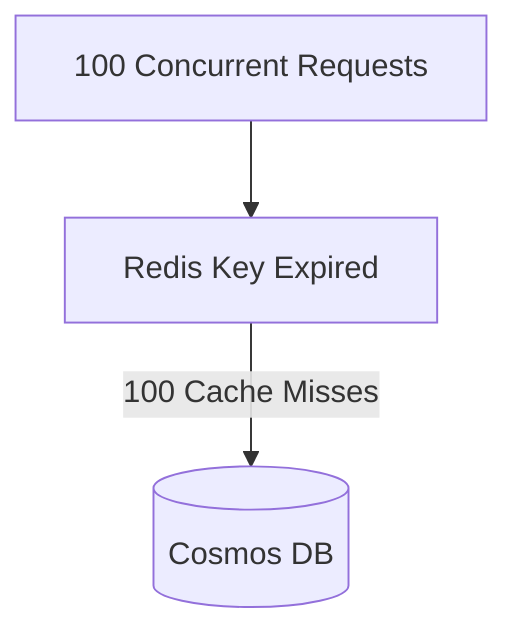
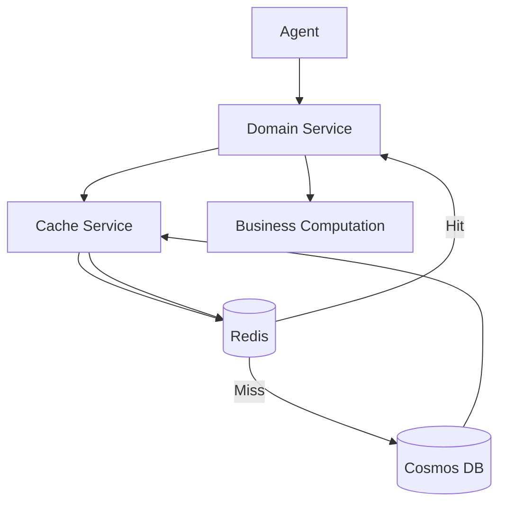
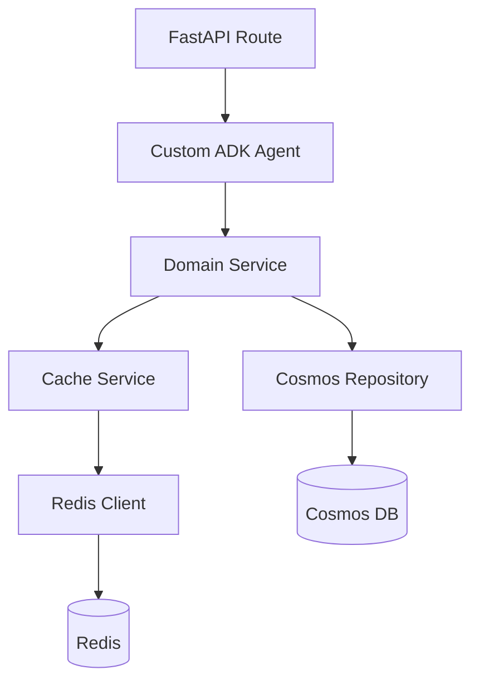
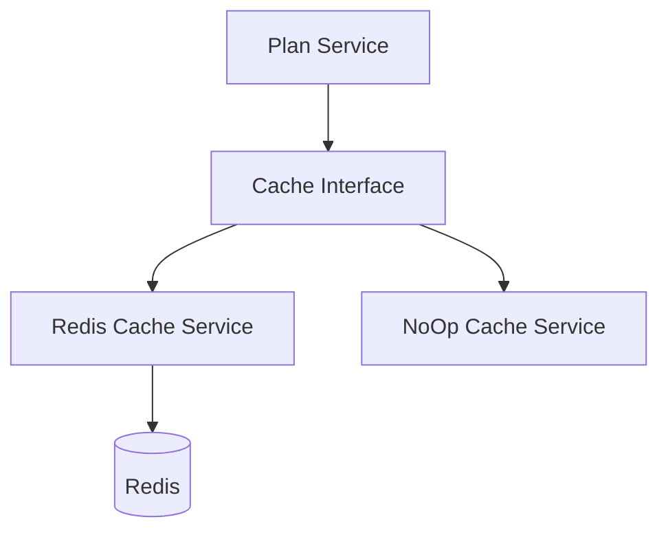
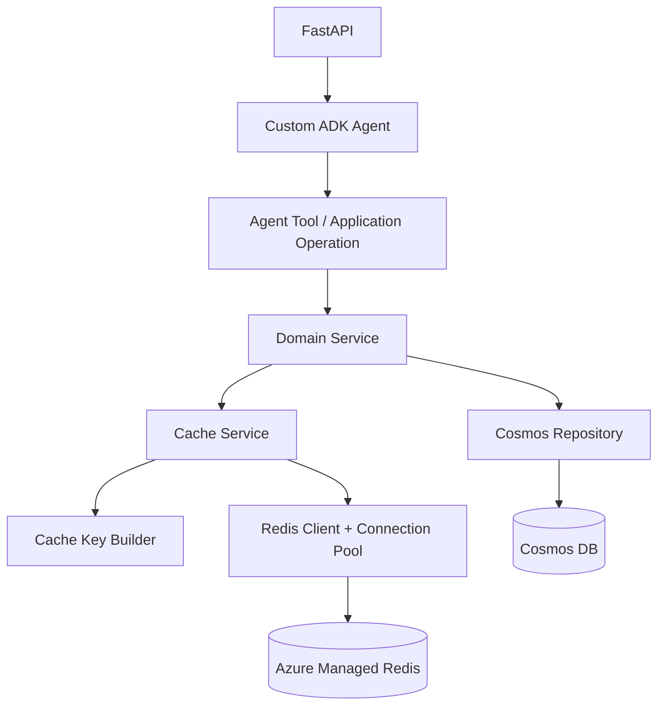

# 3. Detailed Cache Design

## 3.1 Purpose of This Section

This section defines exactly:

- what should be cached,
- what should not be cached,
- where caching should happen,
- how Redis keys should be constructed,
- how long data should remain cached,
- how cache invalidation should work,
- how the six-month data refresh should be handled,
- and how the application should behave under concurrency and failure.

The objective is to avoid treating Redis as:

```text
"Put everything in Redis."
```

Instead, Redis must be used deliberately.

---

# 3.2 Core Caching Principle

The application should follow this rule:

> Cache data that is expensive or unnecessary to repeatedly retrieve or compute, provided that the result can be safely reconstructed from the source of truth.

For this application:

```text
Cosmos DB
    =
Source of Truth

Redis
    =
Reusable Temporary Copy
```

The application must always be capable of reconstructing Redis data from Cosmos.

---

# 3.3 Recommended Initial Caching Scope

The first implementation should focus on:

```text
Cosmos-derived domain data
```

Examples may include:

- employer-level data,
- plan data,
- plan metadata,
- plan configuration,
- reference data,
- normalized values,
- static mappings.

The exact objects depend on the application's current Cosmos schema.

The safest first phase is:

> Cache the reusable data obtained from Cosmos before introducing response caching or broad agent-level caching.

---

# 3.4 What Should Be Cached Initially

Consider a simplified scenario where Cosmos contains:

```text
Employer
    ↓
Plans
    ↓
Plan Attributes
```

Example:

```text
Employer A
    ├── Plan A1
    ├── Plan A2
    ├── Plan A3
    └── Plan A4
```

If the agent repeatedly requires these plans, this is a strong cache candidate.

The flow becomes:

```text
Agent needs Employer A plans

        ↓

Check Redis

        ↓

If available:
    use cached data

If unavailable:
    query Cosmos
    cache the result
    return the result
```

---

# 3.5 Cache Based on Access Pattern, Not Database Structure

A common mistake is to mirror every Cosmos document directly into one Redis key.

Example:

```text
Cosmos Document 1
        ↓
Redis Key 1

Cosmos Document 2
        ↓
Redis Key 2

Cosmos Document 3
        ↓
Redis Key 3
```

This is not always the best approach.

The cache structure should instead reflect:

> How the application actually requests the data.

---

## 3.6 Example: Cache Individual Plans

Suppose the application usually requests one plan at a time.

Then this may be appropriate:

```text
plan:2026_09:employer_a:plan_1

plan:2026_09:employer_a:plan_2

plan:2026_09:employer_a:plan_3
```

This allows individual plan retrieval.

---

## 3.7 Example: Cache Employer-Level Plan Collection

Suppose nearly every agent request retrieves all plans for one employer.

Then this may be better:

```text
employer-plans:2026_09:employer_a
```

The value may contain:

```json
{
  "employer_id": "employer_a",
  "plans": [
    {
      "plan_id": "plan_1"
    },
    {
      "plan_id": "plan_2"
    },
    {
      "plan_id": "plan_3"
    }
  ]
}
```

This can reduce:

```text
multiple Redis GET operations
```

into:

```text
one Redis GET
```

---

# 3.8 Recommended Rule for Cache Granularity

When selecting cache granularity, ask:

```text
"What does the agent normally need together?"
```

If the application normally needs:

```text
all plans belonging to one employer
```

cache them together.

If it normally needs:

```text
only one plan
```

cache individual plans.

The goal should not be:

```text
Mirror Cosmos
```

The goal should be:

```text
Optimize Application Access Pattern
```

---

# 3.9 What Should Not Be Cached Initially

The first implementation should avoid caching:

- arbitrary final LLM responses,
- entire conversation histories,
- user-specific sensitive information,
- temporary agent reasoning state,
- request-specific intermediate state that cannot safely be reused,
- values whose cache identity cannot be deterministically defined,
- rapidly changing information,
- errors unless negative caching is explicitly designed,
- extremely large objects without evaluating Redis memory impact.

---

# 3.10 Why Final Agent Responses Should Not Initially Be Cached

Suppose the user asks:

```text
Which plan is better for me?
```

Caching the final response may look attractive.

However, that response may depend on:

```text
Employer

Selected plans

Current user context

Refinement options

Conversation history

Prompt version

Agent version

Business rules

Calculation logic

User-entered optional information
```

Two requests that appear similar may actually be different.

Example:

```text
User 1:
Which plan is better?

Employer:
A

Coverage:
Employee Only
```

and:

```text
User 2:
Which plan is better?

Employer:
A

Coverage:
Family
```

Caching the final answer incorrectly could return the wrong recommendation.

Therefore:

> Final LLM response caching should not be part of the initial Redis implementation.

It can be evaluated later as a separate optimization.

---

# 3.11 Recommended Initial Cache Layers

The application may eventually support two cache layers.

```text
Layer 1
    ↓
Raw / normalized Cosmos data

Layer 2
    ↓
Deterministic computation results
```

The first implementation should prioritize Layer 1.

---

# 3.12 Layer 1 — Data Cache

Example:

```text
Redis Key:

employer-plans:2026_09:employer_a
```

Value:

```json
{
  "employer_id": "employer_a",
  "plans": [...]
}
```

This prevents repeated Cosmos retrieval.

---

# 3.13 Layer 2 — Computation Cache

Suppose the application performs a deterministic operation such as:

```text
Fetch plans

    ↓

Normalize plans

    ↓

Apply business rules

    ↓

Calculate values

    ↓

Generate ranking
```

If the same inputs always produce the same output, the calculated result may eventually be cached.

Example:

```text
plan-ranking:2026_09:employer_a:employee_only
```

However, this should only be added after measuring whether the computation itself is expensive.

---

# 3.14 Avoid Premature Multi-Level Caching

Do not immediately introduce:

```text
Raw Cache

Normalized Cache

Calculation Cache

Agent Tool Cache

Prompt Cache

Response Cache
```

This creates too many invalidation rules.

The initial implementation should remain simple.

Recommended first phase:

```text
Redis
    ↓
Cache Cosmos-derived reusable data
```

Then measure.

Only add other cache layers when there is evidence that they are required.

---

# 3.15 Redis Key Design

Redis keys should be:

- deterministic,
- predictable,
- versioned,
- easy to inspect,
- easy to debug,
- namespaced,
- safe across environments.

A good general pattern is:

```text
<application>:<environment>:<dataset-version>:<entity>:<identifier>
```

Example:

```text
plan-agent:prod:2026_09:employer-plans:employer_a
```

Another valid simpler pattern is:

```text
employer-plans:2026_09:employer_a
```

The exact prefix should be standardized once for the project.

---

# 3.16 Recommended Cache Key Format

Recommended format:

```text
<app>:<env>:<dataset-version>:<resource>:<resource-id>
```

Example:

```text
benefits-agent:prod:2026_09:employer-plans:apple
```

Example individual plan:

```text
benefits-agent:prod:2026_09:plan:apple:gold-ppo
```

Example calculation:

```text
benefits-agent:prod:2026_09:ranking:apple:employee-only
```

---

# 3.17 Why Environment Should Be in the Key

Normally DEV, STAGE and PROD should use separate Redis instances.

Even then, including the environment in the key provides additional protection.

Example:

```text
benefits-agent:dev:...
benefits-agent:stage:...
benefits-agent:prod:...
```

This makes debugging easier and reduces accidental collision if infrastructure is temporarily shared.

---

# 3.18 Dataset Versioning

The Cosmos data changes approximately once every six months.

This makes dataset versioning extremely useful.

Suppose the current dataset is:

```text
2026_09
```

Keys can be:

```text
benefits-agent:prod:2026_09:employer-plans:apple
```

Six months later, new data is deployed:

```text
2027_03
```

The application begins reading:

```text
benefits-agent:prod:2027_03:employer-plans:apple
```

The application no longer reads:

```text
benefits-agent:prod:2026_09:employer-plans:apple
```

---

# 3.19 Why Versioning Is Better Than Deleting Every Key

Without versioning, data refresh may require:

```text
Find all Redis keys

        ↓

Delete all old keys

        ↓

Hope none were missed
```

This can be risky.

Versioning changes the problem to:

```text
Change DATASET_VERSION

        ↓

Application automatically starts using new namespace
```

The old data becomes unreachable by normal application requests.

Later, old keys can expire naturally.

---

# 3.20 Dataset Version Source

The dataset version must not be manually hard-coded throughout the application.

It should come from configuration.

Example:

```env
DATASET_VERSION=2026_09
```

Application configuration:

```python
settings.dataset_version
```

Cache key generation should consume this value.

---

# 3.21 Dataset Refresh Procedure

A future data refresh can follow:

```text
Step 1

Load the new dataset into Cosmos.


Step 2

Validate the new Cosmos dataset.


Step 3

Update application configuration:

DATASET_VERSION=2027_03


Step 4

Deploy/restart application with new configuration.


Step 5

Application starts generating new Redis keys.


Step 6

First requests cause cache misses.


Step 7

New cache is populated from new Cosmos data.


Step 8

Old cache entries expire naturally.
```

This approach greatly simplifies invalidation.

---

# 3.22 TTL Strategy

Even though the data may change only once every six months, Redis values should still have a TTL.

TTL means:

```text
Time To Live
```

Example:

```text
TTL = 7 days
```

means Redis automatically removes the cached value after seven days.

---

# 3.23 Why TTL Is Still Needed

One might ask:

```text
"If the data changes only every six months,
why not cache it forever?"
```

Because Redis is a cache.

A TTL provides:

- automatic cleanup,
- protection against forgotten keys,
- cleanup of unused employers/plans,
- protection against key-version mistakes,
- natural recovery from stale cache,
- simpler operational management.

---

# 3.24 Initial TTL Recommendation

An initial TTL could be:

```text
7 days
```

or:

```text
30 days
```

The exact value should be selected based on:

- Redis memory capacity,
- number of cacheable entities,
- cache reuse frequency,
- expected data size,
- acceptable periodic Cosmos traffic.

Because the dataset changes very rarely, a long TTL is reasonable.

---

# 3.25 Recommended Starting Point

A reasonable starting configuration is:

```env
CACHE_TTL_SECONDS=604800
```

which means:

```text
7 days
```

Alternatively:

```env
CACHE_TTL_SECONDS=2592000
```

which means:

```text
30 days
```

The value should remain configurable.

It should not be hard-coded into business logic.

---

# 3.26 Versioning + TTL Together

The recommended strategy is:

```text
Dataset Version
        +
TTL
```

Example:

```text
benefits-agent:prod:2026_09:employer-plans:apple

TTL:
7 days
```

If the dataset changes:

```text
2026_09
    ↓
2027_03
```

the application immediately starts using the new namespace.

TTL then cleans up the old namespace.

---

# 3.27 Cache Invalidation Strategy

Cache invalidation should remain as simple as possible.

The primary invalidation mechanisms should be:

### Mechanism 1

TTL expiration.

### Mechanism 2

Dataset version change.

### Mechanism 3

Explicit delete for exceptional cases.

---

# 3.28 Explicit Cache Invalidation

There may be situations where one employer's data needs immediate refresh.

For example:

```text
Employer A plan data was corrected.
```

In that situation, the application or an administrative process may delete:

```text
benefits-agent:prod:2026_09:employer-plans:employer_a
```

The next request causes:

```text
Redis miss
    ↓
Cosmos query
    ↓
Redis repopulated
```

---

# 3.29 Avoid FLUSHALL

The application should never depend on:

```text
FLUSHALL
```

for ordinary cache maintenance.

`FLUSHALL` deletes the entire Redis database.

This is unnecessarily broad and dangerous.

Prefer:

```text
versioned keys
```

or targeted deletion.

---

# 3.30 Cache Serialization

Redis values must be serialized.

Recommended initial format:

```text
JSON
```

Example:

```python
json.dumps(value)
```

and:

```python
json.loads(value)
```

If the application already uses Pydantic models, serialization may use:

```python
model.model_dump_json()
```

and equivalent reconstruction logic.

---

# 3.31 Do Not Cache Mutable Python Objects Directly

Do not assume Python objects can simply be placed into Redis.

Redis stores:

```text
strings / bytes / Redis-native structures
```

Therefore the application should explicitly serialize and deserialize.

---

# 3.32 Large Value Considerations

Before caching extremely large JSON objects, measure:

```text
Serialized size

Number of keys

Expected number of cached employers

Expected Redis memory usage
```

Example:

```text
10 MB per employer
×
500 employers
=
5 GB
```

This may significantly affect Redis sizing.

Therefore observability should eventually capture approximate cache value size where practical.

---

# 3.33 Cache Miss Behaviour

A cache miss is not an error.

It is normal behaviour.

Logs should distinguish:

```text
CACHE_HIT
CACHE_MISS
CACHE_ERROR
```

A miss means:

```text
Redis is working.

The requested data simply isn't cached yet.
```

---

# 3.34 Cache Error Behaviour

A Redis exception is different from a cache miss.

Example:

```text
Connection timeout

Authentication failure

Network error

Redis unavailable
```

These should be treated as:

```text
CACHE_ERROR
```

The request should then fall back to Cosmos when possible.

---

# 3.35 Negative Caching

Negative caching means caching the fact that something does not exist.

Example:

```text
Employer XYZ requested

Cosmos returns:
Not Found
```

Without negative caching:

```text
Request 1 → Cosmos → Not Found
Request 2 → Cosmos → Not Found
Request 3 → Cosmos → Not Found
Request 100 → Cosmos → Not Found
```

A short negative cache could store:

```text
Employer XYZ does not exist
```

for perhaps:

```text
30 seconds
or
5 minutes
```

However, negative caching should **not** be included in the first implementation unless repeated invalid requests become a measurable issue.

It adds additional semantics and should be introduced deliberately.

---

# 3.36 Cache Stampede / Thundering Herd

Consider what happens when a popular cache key expires.

Suppose:

```text
100 requests arrive simultaneously.
```

All perform:

```text
Redis GET
```

All receive:

```text
MISS
```

Then all 100 requests query Cosmos simultaneously.



This is called:

```text
Cache Stampede
```

or:

```text
Thundering Herd
```

---

# 3.37 Initial Cache Stampede Strategy

Do not over-engineer the first implementation.

Initially:

```text
Cache Aside
+
Long TTL
+
Monitoring
```

may be sufficient.

If production metrics show stampede behaviour, introduce request coalescing or a distributed lock.

---

# 3.38 Possible Future Stampede Protection

Example:

```text
Request gets cache miss

        ↓

Try distributed lock

        ↓

Lock acquired?
```

If yes:

```text
Query Cosmos
Populate Redis
Release lock
```

If no:

```text
Wait briefly

        ↓

Check Redis again
```

Redis can support the lock using:

```text
SET key value NX EX <seconds>
```

However:

> Distributed locking is not required for the initial implementation unless load testing demonstrates the need.

---

# 3.39 TTL Jitter

Another future improvement is TTL jitter.

If thousands of keys are all created at the same time with exactly:

```text
TTL = 604800
```

they may all expire together seven days later.

Instead:

```text
Base TTL:
7 days

Random Jitter:
0–30 minutes
```

Then different keys expire at slightly different times.

Example:

```text
Key A:
7 days + 3 minutes

Key B:
7 days + 17 minutes

Key C:
7 days + 26 minutes
```

This reduces synchronized cache expiry.

This can be added if necessary.

---

# 3.40 Caching Deterministic Computations

After the data cache is stable, the team may evaluate computation caching.

Only cache a computation when:

```text
Same Inputs
     ↓
Always
     ↓
Same Output
```

For example:

```text
Employer
+
Plan
+
Coverage Tier
+
Dataset Version
+
Business Rule Version
```

may produce a deterministic calculation.

---

# 3.41 Computation Cache Key Must Include All Relevant Inputs

Bad:

```text
ranking:apple
```

If rankings differ by coverage type, this key is incorrect.

Better:

```text
ranking:2026_09:apple:employee-only
```

If business logic changes independently of dataset changes, add:

```text
rule-version
```

Example:

```text
ranking:2026_09:rules-v3:apple:employee-only
```

Otherwise old calculated results may survive after code logic changes.

---

# 3.42 LLM Outputs Are Not Automatically Deterministic

Even if the same prompt is submitted twice, LLM output can differ.

Therefore:

> Do not treat LLM output like deterministic business computation.

Response caching requires a separate design and is intentionally outside the initial implementation.

---

# 3.43 Sensitive Data Rule

Before adding any Redis key/value, ask:

```text
"Is this safe to cache?"
```

Do not casually cache:

- user-entered personal information,
- sensitive request context,
- authentication tokens,
- authorization data,
- secrets,
- credentials.

The initial cache should primarily contain shared domain/reference data derived from Cosmos.

---

# 3.44 Multi-Tenant Key Isolation

If the application serves multiple employers or tenants, cache keys must include the tenant/employer identifier where required.

Bad:

```text
plans:gold-ppo
```

Potentially ambiguous.

Better:

```text
plans:2026_09:employer_a:gold-ppo
```

This prevents one tenant's cached data from being accidentally used for another.

---

# 3.45 Cache Key Normalization

Identifiers used in keys should be normalized consistently.

For example:

```text
APPLE
Apple
apple
```

should not accidentally become three independent cache namespaces unless they actually represent different identifiers.

Normalization could include:

```python
employer_id.strip().lower()
```

However, normalization rules should match the application's authoritative identifiers.

Do not transform IDs in a way that changes their meaning.

---

# 3.46 Redis Is Not Agent Memory

Even though Redis can technically store:

```text
conversation history
sessions
agent state
```

that is not the goal of this implementation.

The initial Redis contract is:

```text
Redis
    =
Application Cache
```

The existing framework memory server remains a separate concern.

---

# 3.47 Recommended Phase-1 Cache Scope

Phase 1 should contain:

```text
1. Cosmos-derived shared data caching

2. Versioned keys

3. Configurable TTL

4. Graceful Redis failure

5. Metrics for hits/misses/errors

6. Shared cache across backend replicas
```

Phase 1 should **not** contain:

```text
1. LLM response cache

2. Conversation memory

3. Distributed locks unless required

4. Complex multi-level cache

5. Redis persistence dependency

6. Redis as a database
```

---

# 3.48 Cache Design Summary

The recommended cache model is therefore:



The conceptual rule remains:

```text
Redis first

If cache hit:
    use it.

If cache miss:
    Cosmos.

If Redis fails:
    Cosmos.

Cosmos always remains authoritative.
```

---

# 4. Code Implementation Plan

## 4.1 Purpose of This Section

This section defines the changes required in the Python/FastAPI application.

It is intended to provide enough structure that:

- developers know which files to change,
- Copilot understands the intended architecture,
- Redis integration does not leak throughout the agent code,
- environment-specific configuration remains separated from application logic.

---

# 4.2 Implementation Principle

The implementation must preserve this dependency direction:

```text
FastAPI
   ↓
Agent
   ↓
Domain Service
   ↓
Cache Abstraction
   ↓
Redis
```

and:

```text
Domain Service
   ↓
Repository
   ↓
Cosmos
```

The agent should not contain infrastructure logic.

---

# 4.3 Dependency Direction

Recommended:



---

# 4.4 Python Redis Library

Use the standard Python Redis client:

```text
redis
```

with asynchronous support through:

```python
redis.asyncio
```

Example import:

```python
import redis.asyncio as redis
```

The backend already uses asynchronous FastAPI behaviour, therefore blocking Redis calls should be avoided.

---

# 4.5 Dependency Addition

Add the Redis Python package to the project's dependency management.

Depending on the repository, this may be:

```text
requirements.txt
```

or:

```text
pyproject.toml
```

or equivalent.

Example concept:

```text
redis
```

Do not independently introduce multiple Redis libraries unless required.

The entire application should use one Redis client implementation.

---

# 4.6 Configuration Required

The application should receive Redis configuration through environment variables/settings.

Recommended configuration:

```env
CACHE_ENABLED=true

REDIS_HOST=localhost

REDIS_PORT=6379

REDIS_SSL=false

REDIS_DB=0

REDIS_CONNECT_TIMEOUT_SECONDS=2

REDIS_SOCKET_TIMEOUT_SECONDS=2

REDIS_MAX_CONNECTIONS=50

CACHE_TTL_SECONDS=604800

DATASET_VERSION=2026_09

CACHE_KEY_PREFIX=benefits-agent
```

Authentication configuration will depend on the Azure setup.

Possible additional configuration:

```env
REDIS_USERNAME=

REDIS_PASSWORD=
```

or identity-based configuration.

---

# 4.7 Configuration Must Be Centralized

Do not use:

```python
os.getenv("REDIS_HOST")
```

throughout random files.

Instead centralize application configuration.

Example:

```python
from pydantic_settings import BaseSettings


class Settings(BaseSettings):

    cache_enabled: bool = True

    redis_host: str = "localhost"

    redis_port: int = 6379

    redis_ssl: bool = False

    redis_db: int = 0

    redis_connect_timeout_seconds: float = 2.0

    redis_socket_timeout_seconds: float = 2.0

    redis_max_connections: int = 50

    cache_ttl_seconds: int = 604800

    dataset_version: str

    cache_key_prefix: str = "benefits-agent"
```

Existing project configuration conventions should be reused if already available.

---

# 4.8 Same Code Across Environments

The application code should remain identical between:

```text
LOCAL

DEV

STAGE

PROD
```

Only configuration should change.

Example:

### LOCAL

```env
REDIS_HOST=localhost
REDIS_PORT=6379
REDIS_SSL=false
```

### DEV

```env
REDIS_HOST=<dev-redis-host>
REDIS_PORT=<configured-port>
REDIS_SSL=true
```

### STAGE

```env
REDIS_HOST=<stage-redis-host>
REDIS_SSL=true
```

### PROD

```env
REDIS_HOST=<prod-redis-host>
REDIS_SSL=true
```

No branching should exist like:

```python
if environment == "prod":
    use_redis()
else:
    use_something_else()
```

unless there is a genuine requirement.

---

# 4.9 Cache Enable / Disable Switch

A configuration switch should exist:

```env
CACHE_ENABLED=true
```

This is useful for:

- debugging,
- local development,
- comparison testing,
- emergency rollback,
- benchmarking.

If:

```env
CACHE_ENABLED=false
```

the application should bypass Redis and use Cosmos normally.

Example:

```text
CACHE_ENABLED=false

Agent
  ↓
Domain Service
  ↓
Cosmos
```

---

# 4.10 Redis Client Lifecycle

Do not create a Redis client inside every request.

Bad:

```python
@app.post("/chat")
async def chat(...):

    client = redis.Redis(...)

    ...
```

Every incoming request would unnecessarily create connection state.

---

# 4.11 Preferred Lifecycle

Create Redis client infrastructure once during application startup.

Reuse it across requests handled by that pod.

Then clean it up during application shutdown.

Conceptually:

```text
Pod Starts

    ↓

FastAPI startup

    ↓

Create Redis client / pool

    ↓

Handle many requests

    ↓

Pod shutdown

    ↓

Close Redis connection resources
```

---

# 4.12 FastAPI Lifespan Integration

If the application already uses a FastAPI lifespan function, extend that existing function instead of creating competing startup mechanisms.

Example:

```python
from contextlib import asynccontextmanager
from fastapi import FastAPI


@asynccontextmanager
async def lifespan(app: FastAPI):

    app.state.redis = await create_redis_client()

    try:
        yield

    finally:
        if app.state.redis:
            await app.state.redis.aclose()


app = FastAPI(
    lifespan=lifespan
)
```

This is conceptual code.

It should be adapted to the existing application startup pattern.

---

# 4.13 Redis Client Factory

Create a dedicated function or class responsible for Redis client creation.

Example:

```python
import redis.asyncio as redis


def create_redis_client(settings):

    return redis.Redis(
        host=settings.redis_host,
        port=settings.redis_port,
        db=settings.redis_db,
        ssl=settings.redis_ssl,
        socket_connect_timeout=(
            settings.redis_connect_timeout_seconds
        ),
        socket_timeout=(
            settings.redis_socket_timeout_seconds
        ),
        max_connections=(
            settings.redis_max_connections
        ),
        decode_responses=True
    )
```

Authentication fields can be added according to the approved environment design.

---

# 4.14 Connection Pooling

Redis connections should be pooled.

Conceptually:

```text
Backend Pod

FastAPI
    ↓

Redis Client
    ↓

Connection Pool
    ├── Connection 1
    ├── Connection 2
    ├── Connection 3
    └── ...
```

The pool is shared by requests inside that pod.

Each backend pod will maintain its own Redis connection pool.

Example:

```text
Pod 1
    ↓
Pool 1
       \
        \
         Shared Redis

        /
       /
Pod 2
    ↓
Pool 2
```

This is expected behaviour.

---

# 4.15 Do Not Create One Global Pool Across Pods

Pods cannot share Python memory.

Therefore:

```text
Pod 1
has its own Redis connection pool.

Pod 2
has its own Redis connection pool.

Pod 3
has its own Redis connection pool.
```

All pools connect to the same managed Redis service.

---

# 4.16 Redis Connection Validation

During startup, the application may optionally perform:

```text
PING
```

to determine whether Redis is reachable.

Example:

```python
try:
    await redis_client.ping()

except Exception:
    logger.warning(
        "Redis unavailable during startup. "
        "Application will continue using Cosmos fallback."
    )
```

Critical design decision:

> Redis startup failure should normally not prevent the backend pod from starting.

Because Redis is an optimization, not a correctness dependency.

---

# 4.17 Do Not Make Redis a Mandatory Readiness Dependency

Be careful with Kubernetes readiness probes.

If application readiness depends entirely on Redis health:

```text
Redis unavailable
       ↓
Backend marked unready
       ↓
All application traffic stops
```

That conflicts with the desired fallback design.

The backend should generally remain capable of serving requests through Cosmos.

Redis health should be observable separately.

---

# 4.18 Cache Service Interface

A simple abstraction should be introduced.

Example:

```python
from typing import Protocol, Any


class CacheService(Protocol):

    async def get(
        self,
        key: str
    ) -> Any | None:
        ...

    async def set(
        self,
        key: str,
        value: Any,
        ttl_seconds: int
    ) -> None:
        ...

    async def delete(
        self,
        key: str
    ) -> None:
        ...
```

The exact abstraction style should follow the current repository conventions.

---

# 4.19 Redis Cache Service

Example concept:

```python
import json


class RedisCacheService:

    def __init__(
        self,
        redis_client,
        logger
    ):
        self.redis = redis_client
        self.logger = logger

    async def get(
        self,
        key: str
    ):

        try:

            value = await self.redis.get(key)

            if value is None:

                self.logger.debug(
                    "cache_miss",
                    extra={"cache_key": key}
                )

                return None

            self.logger.debug(
                "cache_hit",
                extra={"cache_key": key}
            )

            return json.loads(value)

        except Exception as exc:

            self.logger.warning(
                "cache_get_failed",
                extra={
                    "cache_key": key,
                    "error": str(exc)
                }
            )

            return None

    async def set(
        self,
        key: str,
        value,
        ttl_seconds: int
    ) -> None:

        try:

            serialized = json.dumps(value)

            await self.redis.set(
                key,
                serialized,
                ex=ttl_seconds
            )

        except Exception as exc:

            self.logger.warning(
                "cache_set_failed",
                extra={
                    "cache_key": key,
                    "error": str(exc)
                }
            )
```

This demonstrates the expected behaviour:

```text
Redis GET failure
    ↓
Return None
    ↓
Caller uses Cosmos
```

---

# 4.20 Important Limitation of Returning `None`

If `None` is a legitimate cached value, then:

```text
Cache Miss
```

and:

```text
Cached None
```

become indistinguishable.

For initial domain-data caching this may not matter.

If it does, introduce a structured result such as:

```python
class CacheResult:
    hit: bool
    value: Any
```

Example:

```python
result = await cache.get(key)

if result.hit:
    return result.value
```

Use whichever model best fits actual application data semantics.

---

# 4.21 Cache Key Builder

Create one place responsible for key construction.

Example:

```python
class CacheKeyBuilder:

    def __init__(
        self,
        prefix: str,
        environment: str,
        dataset_version: str
    ):
        self.prefix = prefix
        self.environment = environment
        self.dataset_version = dataset_version

    def employer_plans(
        self,
        employer_id: str
    ) -> str:

        employer_id = employer_id.strip().lower()

        return (
            f"{self.prefix}:"
            f"{self.environment}:"
            f"{self.dataset_version}:"
            f"employer-plans:"
            f"{employer_id}"
        )
```

Example output:

```text
benefits-agent:prod:2026_09:employer-plans:apple
```

---

# 4.22 Why Key Generation Must Be Centralized

Without a key builder:

```python
# file A
f"plan:{employer}:{plan}"

# file B
f"plans:{employer}:{plan}"

# file C
f"{employer}:plan:{plan}"
```

These would create three unrelated cache entries.

Centralized key generation prevents this.

---

# 4.23 Cosmos Repository

Cosmos-specific queries should remain inside the repository/data-access layer.

Example:

```python
class CosmosPlanRepository:

    async def get_employer_plans(
        self,
        employer_id: str
    ):

        # Existing Cosmos query logic.

        ...
```

Redis should not replace the repository.

---

# 4.24 Domain Service Orchestration

The domain service coordinates:

```text
Cache
and
Cosmos
```

Example:

```python
class PlanService:

    def __init__(
        self,
        cache,
        repository,
        key_builder,
        settings
    ):
        self.cache = cache
        self.repository = repository
        self.key_builder = key_builder
        self.settings = settings

    async def get_employer_plans(
        self,
        employer_id: str
    ):

        if not self.settings.cache_enabled:

            return await self.repository.get_employer_plans(
                employer_id
            )

        cache_key = (
            self.key_builder.employer_plans(
                employer_id
            )
        )

        cached = await self.cache.get(
            cache_key
        )

        if cached is not None:

            return cached

        plans = (
            await self.repository.get_employer_plans(
                employer_id
            )
        )

        await self.cache.set(
            cache_key,
            plans,
            ttl_seconds=(
                self.settings.cache_ttl_seconds
            )
        )

        return plans
```

This is the core cache-aside implementation.

---

# 4.25 Agent Integration

Before:

```python
plans = await cosmos_repository.get_employer_plans(
    employer_id
)
```

After:

```python
plans = await plan_service.get_employer_plans(
    employer_id
)
```

The agent does not need:

```python
redis.get(...)
```

or:

```python
redis.set(...)
```

This is intentional.

---

# 4.26 Why the Domain Service Should Own Cache-Aside Behaviour

The domain service understands:

```text
What data is being requested

How it should be identified

Whether it is safe to cache

Which repository retrieves it

Which TTL applies
```

The generic Redis cache layer should not understand:

```text
Employers

Plans

Business Rules
```

That separation keeps the design clean.

---

# 4.27 Example End-to-End Code Path

Conceptually:

```python
@app.post("/chat")
async def chat(request: ChatRequest):

    result = await agent.run(
        request.message
    )

    return result
```

Agent/tool:

```python
async def get_plan_information(
    employer_id: str
):

    return await plan_service.get_employer_plans(
        employer_id
    )
```

Service:

```python
async def get_employer_plans(
    employer_id: str
):

    key = key_builder.employer_plans(
        employer_id
    )

    cached = await cache.get(key)

    if cached is not None:
        return cached

    data = await cosmos_repository.get_employer_plans(
        employer_id
    )

    await cache.set(
        key,
        data,
        ttl_seconds=settings.cache_ttl_seconds
    )

    return data
```

---

# 4.28 Redis Failure Handling

Redis failure must be isolated.

Example:

```python
async def get_employer_plans(
    employer_id: str
):

    cache_key = key_builder.employer_plans(
        employer_id
    )

    cached = await cache.get(
        cache_key
    )

    if cached is not None:

        return cached

    data = await cosmos_repository.get_employer_plans(
        employer_id
    )

    await cache.set(
        cache_key,
        data,
        ttl_seconds=settings.cache_ttl_seconds
    )

    return data
```

If `cache.get()` catches Redis infrastructure failures and returns a miss-like result:

```text
Redis unavailable
       ↓
Cache returns miss
       ↓
Cosmos query
       ↓
Request succeeds
```

Similarly:

```text
Redis SET fails
       ↓
Log error
       ↓
Do not fail user request
```

---

# 4.29 Cosmos Failure Is Different

Redis is optional for correctness.

Cosmos is not.

Therefore:

```text
Redis failure
    ↓
Fallback possible
```

but:

```text
Redis miss
    +
Cosmos failure
    ↓
Request may fail
```

because the authoritative data source is unavailable.

This distinction must appear clearly in logging and alerting.

---

# 4.30 Timeouts

Redis operations should have short timeouts.

The application should not wait a long time for an optional cache.

Bad behaviour:

```text
Redis unavailable

Application waits 30 seconds

Then falls back to Cosmos
```

Better:

```text
Redis unavailable

Short timeout

        ↓

Cosmos fallback
```

Example starting configuration:

```env
REDIS_CONNECT_TIMEOUT_SECONDS=2

REDIS_SOCKET_TIMEOUT_SECONDS=2
```

Actual values should be validated under load testing and network conditions.

---

# 4.31 Avoid Excessive Retry Behaviour

Because Redis is optional, aggressive retry logic may make requests slower.

Avoid:

```text
Redis attempt

wait

retry 1

wait

retry 2

wait

retry 3

then Cosmos
```

for every request.

A small retry strategy may be reasonable for transient failures, but the guiding principle should be:

> Prefer fast fallback to Cosmos over making the user wait for the cache.

---

# 4.32 Cache Metrics

The application should expose or record at least:

```text
cache_hit_total

cache_miss_total

cache_error_total

cache_set_total

cache_get_latency_ms

cache_set_latency_ms
```

Useful additional metrics:

```text
cosmos_fallback_total

cache_value_size_bytes

redis_timeout_total
```

---

# 4.33 Cache Hit Ratio

The important derived metric is:

```text
Cache Hit Ratio
```

Formula:

```text
cache hits
------------------------- × 100
cache hits + cache misses
```

Example:

```text
900 cache hits

100 cache misses
```

Hit ratio:

```text
900
------- × 100
1000

=
90%
```

Because the underlying dataset changes very rarely, commonly accessed entities should eventually achieve a high cache hit ratio.

---

# 4.34 Logging Requirements

Logs should distinguish at least:

```text
CACHE_HIT

CACHE_MISS

CACHE_GET_ERROR

CACHE_SET_ERROR

COSMOS_FALLBACK
```

Do not log full cached payloads by default.

Example log:

```json
{
  "event": "CACHE_HIT",
  "cache_key": "benefits-agent:prod:2026_09:employer-plans:apple",
  "duration_ms": 3
}
```

---

# 4.35 Do Not Log Sensitive Data

Logs should contain:

```text
Cache Key

Duration

Status

Correlation ID

Error Type
```

They should not automatically contain:

```text
Full plan payload

User data

Sensitive request input

Authentication credentials

Redis password
```

---

# 4.36 Correlation With Existing Request Tracing

If the backend already uses:

```text
request IDs

trace IDs

session IDs

MLflow traces

OpenTelemetry

Application Insights
```

cache logs should include the relevant existing correlation identifier.

Example:

```json
{
  "trace_id": "...",
  "event": "CACHE_MISS",
  "resource": "employer-plans",
  "employer_id": "apple"
}
```

This helps trace:

```text
User request

    ↓

Cache miss

    ↓

Cosmos call

    ↓

Agent computation

    ↓

Response
```

---

# 4.37 Dependency Injection

Avoid constructing cache services inside agent functions.

Bad:

```python
async def agent_tool(...):

    redis_client = Redis(...)

    cache = RedisCacheService(
        redis_client
    )
```

Prefer application-level construction.

Conceptually:

```text
Application startup

        ↓

Create Redis client

        ↓

Create CacheService

        ↓

Create Repository

        ↓

Create Domain Service

        ↓

Inject/use inside Agent
```

---

# 4.38 Conceptual Dependency Construction

Example:

```python
redis_client = create_redis_client(
    settings
)

cache_service = RedisCacheService(
    redis_client
)

cosmos_repository = CosmosPlanRepository(
    cosmos_client
)

cache_key_builder = CacheKeyBuilder(
    prefix=settings.cache_key_prefix,
    environment=settings.environment,
    dataset_version=settings.dataset_version
)

plan_service = PlanService(
    cache=cache_service,
    repository=cosmos_repository,
    key_builder=cache_key_builder,
    settings=settings
)
```

The existing framework's dependency-management style should be reused where possible.

---

# 4.39 Cache Disabled Implementation

The application may use either:

```text
conditional logic inside service
```

or a:

```text
NoOpCacheService
```

A NoOp cache is cleaner for larger systems.

Example:

```python
class NoOpCacheService:

    async def get(
        self,
        key: str
    ):
        return None

    async def set(
        self,
        key: str,
        value,
        ttl_seconds: int
    ):
        return None

    async def delete(
        self,
        key: str
    ):
        return None
```

Then:

```text
CACHE_ENABLED=true
    ↓
RedisCacheService


CACHE_ENABLED=false
    ↓
NoOpCacheService
```

The domain service remains unchanged.

---

# 4.40 Optional Cache Abstraction Design



This is particularly useful for:

- unit tests,
- debugging,
- local development without Redis,
- emergency cache disabling.

---

# 4.41 Local Podman Implementation

Local Redis should use Podman.

Example:

```bash
podman pull redis:7
```

Then:

```bash
podman run \
  --name agent-redis \
  -p 6379:6379 \
  -d redis:7
```

Check:

```bash
podman ps
```

Open Redis CLI:

```bash
podman exec -it agent-redis redis-cli
```

Test:

```text
PING
```

Expected:

```text
PONG
```

---

# 4.42 Local Podman Network If Backend Is Also Containerized

Create network:

```bash
podman network create agent-network
```

Run Redis:

```bash
podman run \
  --name redis \
  --network agent-network \
  -d redis:7
```

Run backend:

```bash
podman run \
  --name backend \
  --network agent-network \
  -e REDIS_HOST=redis \
  -e REDIS_PORT=6379 \
  <backend-image>
```

Then:

```text
backend
    ↓
redis:6379
```

---

# 4.43 Do Not Build Local Code Around `localhost`

The code should never assume:

```python
host = "localhost"
```

Instead:

```python
host = settings.redis_host
```

This allows:

```text
Local Host Process
    ↓
localhost

Local Podman Containers
    ↓
redis

Azure
    ↓
managed Redis hostname
```

without code changes.

---

# 4.44 Development Deployment Requirements

DEV infrastructure should provide:

```text
Redis Host

Redis Port

TLS Setting

Authentication Method

Network Connectivity

DNS Resolution
```

The backend deployment should receive these through the approved Kubernetes/Azure configuration mechanism.

---

# 4.45 Stage Deployment Requirements

Stage should additionally validate:

```text
Multiple backend replicas

Private connectivity

Redis authentication

TLS

Connection pooling

Cache consistency

Dataset version update

Redis outage fallback

Cache warm-up behaviour
```

---

# 4.46 Production Deployment Requirements

Production infrastructure must provide:

```text
Managed Redis Instance

Private Network Connectivity

Approved Authentication

Monitoring

Capacity Configuration

High Availability Configuration

Alerting
```

The backend deployment must receive only the information necessary to connect.

---

# 4.47 Secrets

Do not place credentials directly inside:

```text
source code

Git repository

Dockerfile

plain Kubernetes deployment YAML
```

Examples of prohibited patterns:

```python
REDIS_PASSWORD = "actual-password"
```

or:

```yaml
env:
  - name: REDIS_PASSWORD
    value: "actual-password"
```

Use the organization's approved secret-management pattern.

Examples may include:

```text
Azure Managed Identity

Azure Key Vault

Kubernetes secret integration

Workload Identity
```

depending on current organizational standards.

---

# 4.48 Container Image Changes

The backend image only requires application dependency changes.

The application container remains:

```text
FastAPI
+
Custom ADK Agent
+
Redis Python Client
+
Existing Dependencies
```

Redis does **not** run inside the same backend container.

Do not create:

```text
One Container

├── FastAPI
├── Agent
└── Redis Server
```

That is not the intended architecture.

---

# 4.49 Kubernetes Backend Deployment

The backend AKS deployment remains conceptually:

```text
Deployment
    ↓
Replica 1
    FastAPI + Agent

Replica 2
    FastAPI + Agent

Replica N
    FastAPI + Agent
```

Each pod connects externally to:

```text
Redis
and
Cosmos
```

---

# 4.50 Health Check Strategy

Application health checks should distinguish:

```text
Application Health

Cosmos Health

Redis Health
```

Redis being unhealthy should be reported but should not necessarily make:

```text
/health
```

fail completely.

Possible health response:

```json
{
  "status": "degraded",
  "components": {
    "application": "healthy",
    "cosmos": "healthy",
    "redis": "unavailable"
  }
}
```

The exact health API depends on current platform requirements.

---

# 4.51 Why `degraded` Is Useful

It communicates:

```text
Application is functional

but

cache is unavailable
```

This matches the architectural intent.

---

# 4.52 Unit Testing

Unit tests should cover at least the following.

### Test 1 — Cache Hit

```text
Redis returns data

Expected:

Cosmos repository is NOT called
```

---

### Test 2 — Cache Miss

```text
Redis returns no value

Expected:

Cosmos is called

Redis SET is called

Cosmos value is returned
```

---

### Test 3 — Redis GET Failure

```text
Redis raises timeout

Expected:

Cosmos is called

Request succeeds if Cosmos succeeds
```

---

### Test 4 — Redis SET Failure

```text
Cosmos succeeds

Redis SET fails

Expected:

Cosmos value is still returned
```

---

### Test 5 — Cache Disabled

```text
CACHE_ENABLED=false

Expected:

Redis is bypassed

Cosmos is called
```

---

### Test 6 — Correct Cache Key

Given:

```text
environment=prod

dataset_version=2026_09

employer=apple
```

Expected:

```text
benefits-agent:prod:2026_09:employer-plans:apple
```

---

# 4.53 Example Unit Test Concept

```python
async def test_cache_hit_does_not_call_cosmos():

    cache.get.return_value = cached_plans

    result = await service.get_employer_plans(
        "apple"
    )

    assert result == cached_plans

    repository.get_employer_plans.assert_not_called()
```

---

# 4.54 Integration Testing

Integration tests should verify:

```text
Application

    ↓

Actual Redis test instance

    ↓

Cache write

    ↓

Cache read
```

Local integration tests can use Podman Redis.

---

# 4.55 Stage Failure Testing

Stage should test:

```text
1. Start application normally.

2. Populate Redis.

3. Verify cache hits.

4. Temporarily make Redis unavailable.

5. Send requests.

6. Verify application continues using Cosmos.

7. Restore Redis.

8. Verify cache starts populating again.
```

This validates the most important resilience requirement.

---

# 4.56 Multi-Pod Testing

Stage should also test shared cache behaviour.

Example:

```text
Request routed to Pod 1

        ↓

Cache miss

        ↓

Cosmos

        ↓

Redis populated
```

Then:

```text
Request routed to Pod 2

        ↓

Redis hit

        ↓

No Cosmos read
```

This confirms Redis is actually providing shared caching.

---

# 4.57 Dataset Version Test

Stage should test:

Initial configuration:

```env
DATASET_VERSION=2026_09
```

Cache populated.

Then change:

```env
DATASET_VERSION=2027_03
```

Expected:

```text
Old keys remain temporarily

but

application no longer reads them.

New requests produce misses.

New cache namespace is populated.
```

---

# 4.58 Performance Testing

Compare the following.

### Baseline

```text
Redis disabled
```

Measure:

- response latency,
- Cosmos calls,
- Cosmos RU consumption,
- throughput.

### Cache Enabled

```text
Redis enabled
```

Measure the same metrics.

Expected result:

```text
Higher cache hit rate

Lower repeated Cosmos traffic

Reduced data-access latency
```

---

# 4.59 Cold Cache vs Warm Cache

Testing must distinguish:

```text
Cold Cache
```

and:

```text
Warm Cache
```

Cold cache:

```text
Redis empty
```

Warm cache:

```text
Frequently used values already present
```

These will have different performance characteristics.

---

# 4.60 Rollout Strategy

Do not switch everything to Redis in one uncontrolled change.

Recommended rollout:

```text
Phase 1

Add Redis infrastructure.


Phase 2

Add Redis client and cache abstraction.


Phase 3

CACHE_ENABLED=false.

Deploy code.


Phase 4

Verify application behaves unchanged.


Phase 5

Enable cache in DEV.


Phase 6

Validate hit/miss/fallback behaviour.


Phase 7

Enable in Stage.


Phase 8

Load test.


Phase 9

Enable in Production.


Phase 10

Monitor hit ratio and Cosmos reduction.
```

---

# 4.61 Feature Flag / Emergency Disable

Because:

```env
CACHE_ENABLED=false
```

exists, rollback does not necessarily require removing Redis code.

If an incident occurs:

```text
Redis caching suspected

        ↓

Disable cache

        ↓

Application goes directly to Cosmos
```

This is operationally valuable.

---

# 4.62 Code Changes Required

The exact filenames should be adapted to the current repository.

At minimum, implementation likely requires:

### Add

```text
cache/
    redis_client.py

cache/
    cache_service.py

cache/
    cache_keys.py
```

Possibly:

```text
cache/
    serializers.py

cache/
    exceptions.py
```

---

### Modify

```text
application settings/configuration

FastAPI lifespan/startup

domain/data service

existing Cosmos-access path

dependency definitions

unit tests

integration tests

deployment environment variables
```

---

### Infrastructure Required

```text
LOCAL
    Redis Podman container


DEV
    Managed Redis preferred


STAGE
    Azure Managed Redis


PROD
    Azure Managed Redis
```

---

# 4.63 Copilot Implementation Instructions

When Copilot is used to implement this plan, it should follow these rules.

```text
1. Do not create a separate FastAPI service.

2. Do not create a separate agent service.

3. FastAPI and the Custom ADK Agent remain one backend application.

4. Do not run Redis server inside the backend application container.

5. Do not directly add Redis GET/SET calls throughout agent code.

6. Create a reusable cache abstraction.

7. Keep Cosmos as the source of truth.

8. Use the cache-aside pattern.

9. Redis errors must fall back to Cosmos.

10. Redis SET failure must not fail an otherwise successful request.

11. Redis GET failure must not prevent Cosmos access.

12. Cache keys must be centrally generated.

13. Cache keys must include dataset version.

14. Tenant/employer identifiers must be included where required.

15. TTL must be configurable.

16. Redis host/port/security must be configuration-driven.

17. Do not hard-code credentials.

18. Use asynchronous Redis operations.

19. Reuse Redis connection pools.

20. Initialize Redis during application lifecycle.

21. Close Redis resources during shutdown.

22. Add hit/miss/error observability.

23. Add unit tests for cache hit, miss and failure.

24. Preserve existing agent behaviour.

25. Do not introduce conversation memory into Redis as part of this work.
```

---

# 4.64 Copilot Must Inspect Existing Code Before Creating New Layers

Before adding new files, Copilot should inspect whether equivalent components already exist.

Examples:

```text
Existing Cosmos Repository?

Existing Service Layer?

Existing Settings Class?

Existing Dependency Injection?

Existing FastAPI Lifespan?

Existing Metrics Utility?

Existing Logging Utility?
```

If yes:

> Extend the existing abstraction instead of creating duplicate architecture.

For example, if the repository already contains:

```text
src/database/cosmos.py
```

do not automatically create:

```text
src/repositories/cosmos_repository.py
```

unless restructuring is explicitly approved.

---

# 4.65 Implementation Sequence for Copilot

Recommended code implementation order:

```text
Step 1
Inspect existing Cosmos access path.

Step 2
Identify the service that should own cache-aside logic.

Step 3
Add Redis dependency.

Step 4
Add configuration fields.

Step 5
Create Redis client initialization.

Step 6
Create cache abstraction/service.

Step 7
Create centralized cache key builder.

Step 8
Integrate cache-aside logic into one domain data path.

Step 9
Add graceful error handling.

Step 10
Add logs and metrics.

Step 11
Add unit tests.

Step 12
Run locally using Podman Redis.

Step 13
Validate cache hit and cache miss.

Step 14
Validate Redis failure fallback.

Step 15
Only then expand caching to additional data paths.
```

---

# 4.66 Do Not Cache Everything in the First Pull Request

The first implementation should preferably prove the pattern using one high-value data path.

For example:

```text
Employer Plan Retrieval
```

Once this works:

```text
Cache abstraction proven

Key design proven

Redis connectivity proven

Fallback proven

Metrics proven
```

Then additional data paths can be migrated.

This reduces implementation risk.

---

# 4.67 Definition of Done for Code Implementation

The Redis implementation is considered functionally complete when all of the following are true:

```text
[ ] Application starts with Redis enabled.

[ ] Application starts with Redis disabled.

[ ] Redis client is created once per backend process.

[ ] Redis client uses connection pooling.

[ ] Cache hit avoids Cosmos retrieval.

[ ] Cache miss retrieves from Cosmos.

[ ] Cache miss populates Redis.

[ ] Redis GET failure falls back to Cosmos.

[ ] Redis SET failure does not fail user request.

[ ] Cache keys include dataset version.

[ ] Cache TTL is configurable.

[ ] Local Redis works through Podman.

[ ] Multiple backend replicas share the same Redis cache.

[ ] Cache hit metrics exist.

[ ] Cache miss metrics exist.

[ ] Cache error metrics exist.

[ ] Logs contain enough information for troubleshooting.

[ ] No Redis credentials are committed to source control.

[ ] Existing Custom Framework Memory Server is not required.

[ ] Agent code is not directly coupled to Redis.

[ ] Unit tests pass.

[ ] Integration tests pass.

[ ] Stage fallback testing succeeds.
```

---

# 4.68 Final Code-Side Architecture

After implementation, the application should conceptually look like:



The important separation is:

```text
Agent
    ↓
asks for business/domain data

Domain Service
    ↓
decides how data is retrieved

Cache Service
    ↓
knows Redis

Cosmos Repository
    ↓
knows Cosmos
```

The agent itself does not need to understand the caching infrastructure.

---

# 4.69 Final Implementation Principle

The most important code principle is:

```text
Caching should be transparent to the agent.
```

From the agent's perspective:

```python
plans = await plan_service.get_employer_plans(
    employer_id
)
```

The agent should not care whether internally that operation was:

```text
Redis Hit
```

or:

```text
Redis Miss
    ↓
Cosmos
    ↓
Redis Populate
```

or:

```text
Redis Failure
    ↓
Cosmos Fallback
```

That separation keeps the architecture maintainable and allows Redis to remain what it should be:

> **A performance optimization, not a business dependency.**
